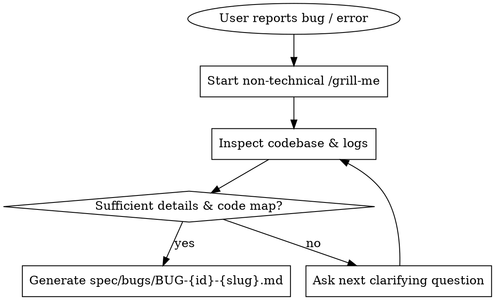

# Bug Reporting Skill (`bug-reporting`)

## Overview

**A bug report is failed work if another agent cannot open `spec/bugs/BUG-*.md` and immediately write a failing PHPUnit/Dusk test and code the exact fix without asking a single follow-up question.**

This skill governs how to interview users, investigate the codebase, and author ultra-detailed, 100% reproducible bug specifications saved to `spec/bugs/BUG-{id}-{slug}.md`.

---

## Process Flow



---

## Core Protocol & Rules

### Rule 1: Mandatory Non-Technical `/grill-me` Interview
When a user reports a bug, **NEVER** assume details or write a bug report based on a 1-sentence prompt.
You MUST launch an exhaustive `/grill-me` interview using `ask_question` (one question at a time).

**Guiding Principles for Questions:**
- **Keep it non-technical for the user:** Ask about user roles, UI actions, buttons clicked, form inputs, expected happy-path outcome vs actual error.
- **Do NOT ask the user for PHP stack traces, SQL lines, or controller names:** You (the agent) will trace the code automatically based on the user's scenario.
- **Provide clear, intuitive options** with a recommended default in `ask_question`.

### Rule 2: Concurrent Codebase & Log Mapping
For every response the user provides, you MUST immediately use your code search and log tools (`grep_search`, `view_file`, `laravel-boost:read-log-entries`, `laravel-boost:browser-logs`) to:
1. Locate the exact Blade views, routes, controllers, form requests, policies, and Eloquent models involved.
2. Find existing failure/success logs or Dusk/PHPUnit tests for the affected feature.
3. Identify exact line numbers, DB queries, and failure branches.

### Rule 3: Output File Contract
Every bug report MUST be written to `spec/bugs/BUG-{id}-{slug}.md` using `write_to_file`.

---

## `/grill-me` Question Playbook

Ask questions sequentially until every item in this checklist is 100% clear:

1. **User Role & Multitenant Context:**
   - Which user role is performing the action? (Admin, Gestor, Aluno, Guest/Unauthenticated)
   - Which organization/tenant context is active? (Single tenant, specific `org_id`, multi-org switching)
2. **Pre-conditions & Environment:**
   - What state must the system/database be in before starting? (e.g., student enrolled in Course X, quiz submitted, certificate issued)
3. **Exact Step-by-Step Actions (The Trigger):**
   - What page/URL did the user navigate to?
   - What specific buttons were clicked, forms filled, or payloads sent?
4. **Expected vs Actual Behavior:**
   - What should have happened in a successful scenario (Happy Path)?
   - What actually happened? (500 Error page, validation message, silent failure, wrong redirect, missing database record)
5. **Reproducibility & Scope:**
   - Does this happen every time (100%), or only under specific conditions (edge cases, specific browser, specific user)?

---

## Bug Report Specification Template (`spec/bugs/BUG-{id}-{slug}.md`)

The generated file MUST adhere strictly to the following structure:

```markdown
# BUG-{id}: {Short Descriptive Title}

## 1. Executive Summary & Impact
- **ID:** BUG-{id}
- **Severity:** High / Medium / Low
- **Affected Role(s):** Admin | Gestor | Aluno | Guest
- **Tenant Context:** Org-scoped (`org_id`) | Admin-global | Cross-tenant
- **Summary:** Concise description of what breaks, under what conditions, and user impact.

## 2. Step-by-Step Reproduction Guide
### Pre-conditions:
1. ...
2. ...

### Reproduction Steps:
1. Log in as `{Role}` (Org: `{OrgName/ID}`).
2. Navigate to `{Route/URL}`.
3. Perform action `{Action}` with input parameters:
   - `field_name`: "value"
4. Observe the failure.

### Expected Behavior (Happy Path):
- {Clear statement of what should occur}

### Actual Behavior (Bug):
- {Detailed description of error/unexpected state}

## 3. Codebase & Architectural Mapping
- **Route Name / URL:** `admin.courses.index` (`/admin/cursos`)
- **Controller / Action:** `App\Http\Controllers\CourseController@store` ([CourseController.php](file:///path/to/CourseController.php#L45-L60))
- **Form Request / Validation:** `App\Http\Requests\StoreCourseRequest` ([StoreCourseRequest.php](file:///path/to/StoreCourseRequest.php#L15))
- **Model / Database Table:** `App\Models\Course` (`courses` table)
- **Policy / Auth Gate:** `App\Policies\CoursePolicy` ([CoursePolicy.php](file:///path/to/CoursePolicy.php#L20))
- **Blade View / Component / JS:** `resources/views/courses/create.blade.php`

## 4. Root Cause Technical Analysis
- **Failure Branch:** Line {X} in `{Class}` fails because {exact technical reason, e.g. missing `org_id` in query scope, unhandled exception, null pointer, unvalidated input}.
- **Stack Trace / Log Evidence:**
  ```text
  [YYYY-MM-DD HH:MM:SS] local.ERROR: UnresolvedOrgContextException...
  ```

## 5. Test Specification Plan (TDD Blueprint)
### Unit / Feature Test (PHPUnit):
- **Test File:** `tests/Feature/CourseManagementTest.php`
- **Test Method:** `it_prevents_unauthorized_course_creation()`
- **Assertions:**
  - Send POST request to route with data.
  - Assert response status (e.g. 422 or 403).
  - Assert database missing / model state.

### Browser Test (Laravel Dusk - if UI bug):
- **Test File:** `tests/Browser/CourseUiTest.php`
- **Selectors to interact with:** `dusk="submit-course-btn"`, `dusk="error-alert"`

## 6. Acceptance Criteria for Fix Verification
- [ ] Fix passes PHPUnit test `tests/Feature/...`
- [ ] Fix passes Dusk E2E test `tests/Browser/...`
- [ ] No regression introduced in related tenant/auth scopes.
```

---

## Red Flags - STOP and Grill Further

If your draft bug report contains any of the following, **DO NOT SAVE IT YET**. Ask more questions via `ask_question` and inspect the code further:

- 🚩 "The user gets an error on the page" (Which error? What status code? What did the UI show?)
- 🚩 "Fill in the form" (Which specific fields and values cause the bug?)
- 🚩 "Somewhere in the controller" (Which controller? Which line number? Which file?)
- 🚩 "It fails sometimes" (What specific state/condition triggers the failure?)

---

## Rationalization Table

| Excuse for skipping `/grill-me` | Reality |
| :--- | :--- |
| "The user gave a good overview, I can guess the rest." | Guessing leads to wrong fixes and broken tests. Grill until 100% precise. |
| "I'll ask technical questions about lines and classes." | Users know business scenarios; agents map technical code. Keep grill non-technical, map code yourself. |
| "Writing the file with missing details is fine for now." | An incomplete bug report wastes developer/agent context. Make it 100% actionable. |
