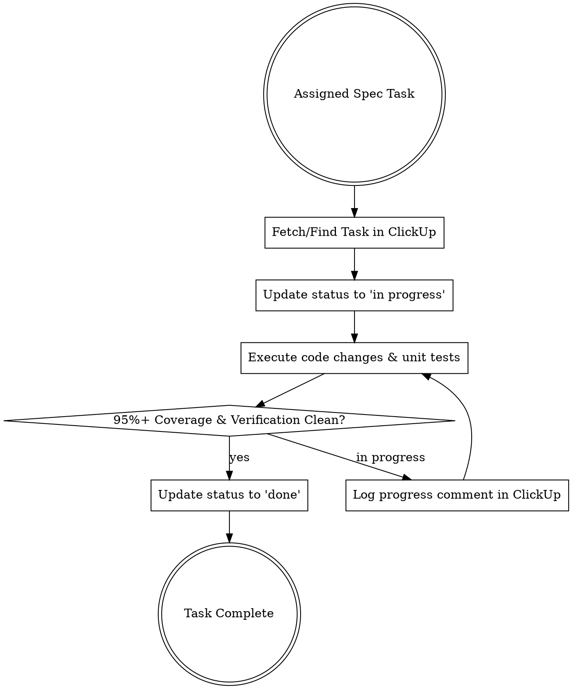

# ClickUp Spec Development Tracking Skill

## Overview

This skill establishes the mandatory workflow for AI agents and developers implementing features from technical specifications (`spec/specs/`). **Every spec implementation task MUST be tracked autonomously in ClickUp via ClickUp MCP tools.**

**Core Principle:** No spec task development is started, modified, or completed without updating its corresponding task status and progress evidence in ClickUp.

---

## ClickUp Project Context

- **Workspace:** `90171427561`
- **ClickUp List Name:** `Cursos`
- **ClickUp List ID:** `901715628342`
- **List URL:** [ClickUp Board](https://app.clickup.com/90171427561/v/l/2kza5jq9-317)

---

## Mandatory Tracking Workflow

Whenever an agent is assigned to develop, modify, or verify a spec task (e.g., `SPEC-00` through `SPEC-10`), it MUST execute the following 4-step tracking loop:



---

## Step-by-Step Tool Operations

### 1. Locate Task Before Starting
Before touching any code, find the task in ClickUp corresponding to the spec file:
- Use `clickup_filter_tasks` with `list_ids=["901715628342"]` or search by spec key (e.g. `[SPEC-01]`).

### 2. Transition to `in progress`
Immediately after starting work on a task:
- Call `clickup_update_task` with `task_id` and `status="in progress"` (or `doing` / `active`).

### 3. Log Implementation Progress
When completing significant subcomponents or running test suites:
- Call `clickup_create_comment` to post structured markdown updates:
  ```markdown
  ### 🚀 Progress Update - [SPEC-XX]
  - **Component:** `App\Services\UserImportService` implemented
  - **Tests Run:** `vendor/bin/sail artisan test --filter=UserImportServiceTest`
  - **Coverage:** 96.4%
  - **Status:** In progress (moving to Blade view interactions)
  ```

### 4. Close Task with Evidence
Before marking a task complete:
- Verify that test coverage $\ge 95,00\%$ and all acceptance criteria from the spec are satisfied.
- Call `clickup_create_comment` with final test run output and coverage evidence.
- Call `clickup_update_task` with `status="done"` (or `closed`).

---

## Status Mapping Reference

| Spec Execution State | ClickUp Status Value | Tool Action |
| :--- | :--- | :--- |
| Task pending start | `to do` / `backlog` | `clickup_create_task` |
| Active development | `in progress` / `doing` | `clickup_update_task` |
| Code review / Refinement | `in review` / `tech review` | `clickup_update_task` |
| Completed & verified (95%+ tests) | `done` / `complete` / `closed` | `clickup_update_task` |

---

## Rationalization Table (Red Flags)

| Excuse / Rationalization | Reality & Rule |
| :--- | :--- |
| *"I'll update ClickUp after I finish writing all the code."* | **Forbidden.** ClickUp must reflect active state in real time. Update status to `in progress` BEFORE coding. |
| *"ClickUp tracking is optional for small bug fixes or refactors."* | **Forbidden.** Every change linked to a spec must be tracked in ClickUp. |
| *"I can mark the ClickUp task as done without running tests."* | **Forbidden.** Task closure in ClickUp requires empirical test execution evidence and 95%+ coverage verification. |
| *"I'll create tasks manually in my head."* | **Forbidden.** Use `clickup_create_task` and `clickup_update_task` MCP tools exclusively. |

---

## Common Mistakes & Troubleshooting

1. **Incorrect List ID:** Always pass `list_id="901715628342"` for the Cursos project.
2. **Missing Description Format:** Ensure task descriptions contain the spec reference (`spec/specs/XX-name.md`), acceptance criteria checklist, and requirement IDs (RFs, RNs, UCs).
3. **Skipping Comments:** Do not silently update statuses; add explanatory comments via `clickup_create_comment` when transitioning tasks to `in review` or `done`.
