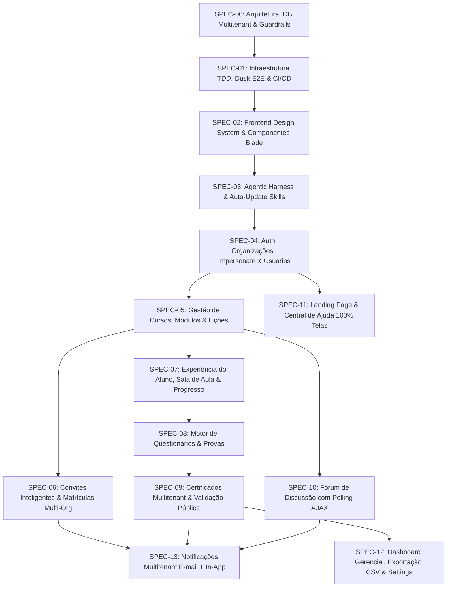

# Plataforma EAD Multitenant

Plataforma de Ensino a Distância (EAD) Multi-organização desenvolvida em **Laravel 13** e **PHP 8.5**, projetada com arquitetura **Single-Database Multitenancy** (`org_id` + `OrgScope`), desenvolvimento orientado a testes (**TDD**) e testes end-to-end (**Laravel Dusk**).

---

## 📐 Visão Geral & Arquitetura

- **Multitenancy Single-Database**: Isolamento rigoroso de dados por organização através de `org_id` e Trait global `OrgScope`.
- **Controle de Acesso em Níveis (Roles)**:
  - `Admin`: Acesso global, gestão de organizações e impersonation.
  - `Gestor`: Gestão da sua organização (cursos, módulos, lições, alunos, relatórios).
  - `Aluno`: Acesso multi-organização a cursos matriculados, sala de aula e certificados.
- **Frontend & UI**: Blade Components + Bootstrap 5.3 com Design System estruturado.
- **TDD & Qualidade**: Cobertura de testes automatizados (PHPUnit/Pest) + Testes E2E de navegador com Laravel Dusk.

---

## 🗺️ Roadmap & Ordem Sistemática TDD

O desenvolvimento do sistema segue a ordem de dependências abaixo, priorizando a infraestrutura de testes na **Fase 1**:



---

## 📚 Repositório de Especificações Técnicas (`spec/specs/`)

As especificações detalhadas de cada módulo encontram-se no diretório `spec/specs/`:

1. **[`00-architecture-database-and-guardrails.md`](file:///home/rafael/projects/cursos/plataforma_ead/spec/specs/00-architecture-database-and-guardrails.md)**: Arquitetura Geral Multitenant, tabela `organizations`, esquema de banco de dados (19 tabelas), Trait `OrgScope`, Roles Spatie (`admin`, `gestor`, `aluno`), 95%+ de Cobertura e **Testes E2E com Laravel Dusk**.
2. **[`01-testing-guardrails-dusk-e2e-and-ci-cd.md`](file:///home/rafael/projects/cursos/plataforma_ead/spec/specs/01-testing-guardrails-dusk-e2e-and-ci-cd.md)**: Infraestrutura TDD & Quality Gate CI/CD, configuração SQLite em memória, drivers Dusk E2E e script auditor de cobertura.
3. **[`02-frontend-design-system-blade-components-and-layout.md`](file:///home/rafael/projects/cursos/plataforma_ead/spec/specs/02-frontend-design-system-blade-components-and-layout.md)**: Layout Master particionado, Design System CSS, Bootstrap 5.3 e catálogo de micro-componentes Blade.
4. **[`03-agentic-harness-and-self-updating-skills.md`](file:///home/rafael/projects/cursos/plataforma_ead/spec/specs/03-agentic-harness-and-self-updating-skills.md)**: Agentic Harness & Protocolo de Auto-Update de Skills.
5. **[`04-auth-profile-organizations-and-user-management.md`](file:///home/rafael/projects/cursos/plataforma_ead/spec/specs/04-auth-profile-organizations-and-user-management.md)**: Autenticação, Perfil, CRUD de Organizações, Impersonate Org pelo Admin e Gestão de Usuários com Importação CSV.
6. **[`05-courses-modules-and-content-management.md`](file:///home/rafael/projects/cursos/plataforma_ead/spec/specs/05-courses-modules-and-content-management.md)**: Gestão Multitenant de Cursos, Módulos com reordenação AJAX e Lições Multimídia (Texto, Imagem, PDF, Vídeo YouTube).
7. **[`06-smart-invitation-and-enrollment-system.md`](file:///home/rafael/projects/cursos/plataforma_ead/spec/specs/06-smart-invitation-and-enrollment-system.md)**: Links de Convite por Org, Auto-cadastro e Fluxo Adaptativo Multi-Org para Alunos.
8. **[`07-student-learning-experience-and-progress.md`](file:///home/rafael/projects/cursos/plataforma_ead/spec/specs/07-student-learning-experience-and-progress.md)**: Área do Aluno "Meus Cursos", Sala de Aula, Players, Conclusão de Aulas e Middleware `EnsureStudentIsEnrolled`.
9. **[`08-quizzes-and-evaluations-engine.md`](file:///home/rafael/projects/cursos/plataforma_ead/spec/specs/08-quizzes-and-evaluations-engine.md)**: Motor de Questionários, Player de Provas, Correção Automática, Retries e Gabarito Condicional.
10. **[`09-certificates-and-public-verification.md`](file:///home/rafael/projects/cursos/plataforma_ead/spec/specs/09-certificates-and-public-verification.md)**: Regras de Liberação de Certificados, Geração de PDF com marca da Organização, Hash SHA-256 e Validação Pública Global (`/validar-certificado`).
11. **[`10-course-discussion-forum.md`](file:///home/rafael/projects/cursos/plataforma_ead/spec/specs/10-course-discussion-forum.md)**: Fórum de Discussão do Curso por `org_id`, Sanitização XSS e Polling AJAX.
12. **[`11-landing-page-and-contextual-help-center.md`](file:///home/rafael/projects/cursos/plataforma_ead/spec/specs/11-landing-page-and-contextual-help-center.md)**: Landing Page Pública, Central de Ajuda Integral (`<x-help-button key="..." />`) em 100% das telas.
13. **[`12-admin-dashboard-analytics-and-system-settings.md`](file:///home/rafael/projects/cursos/plataforma_ead/spec/specs/12-admin-dashboard-analytics-and-system-settings.md)**: Dashboard Gerencial, Exportação CSV em Streaming $O(1)$ de RAM e Configurações Globais/Por Org.
14. **[`13-notifications-and-alerts.md`](file:///home/rafael/projects/cursos/plataforma_ead/spec/specs/13-notifications-and-alerts.md)**: Notificações Multitenant (E-mail + In-App).

Consulte também o estudo detalhado da arquitetura em **[`spec/docs/multitenancy.md`](file:///home/rafael/projects/cursos/plataforma_ead/spec/docs/multitenancy.md)**.

---

## 🚫 Escopo Explícito (Fora de Alcance)

- **Pagamentos / Billing / Assinatura**: Não existe módulo financeiro na plataforma. O campo `organizations.cnpj` é estritamente um dado cadastral/institucional (utilizado na identidade visual do certificado em SPEC-09).

---

## 🚀 Como Executar o Projeto

Este projeto utiliza **Laravel Sail** (Docker). Sempre execute os comandos através do Sail:

### Subir os containers

```bash
vendor/bin/sail up -d
```

### Executar Migrações e Seeders

```bash
vendor/bin/sail artisan migrate --seed
```

### Executar Suíte de Testes (PHPUnit / Pest)

```bash
vendor/bin/sail artisan test
```

### Executar Testes E2E (Laravel Dusk)

```bash
vendor/bin/sail artisan dusk
```

### Checar Cobertura de Código

```bash
vendor/bin/sail php scripts/check-coverage.php
```

---

## 📄 Licença

Este projeto é um software proprietário/interno desenvolvido para a Plataforma EAD.
