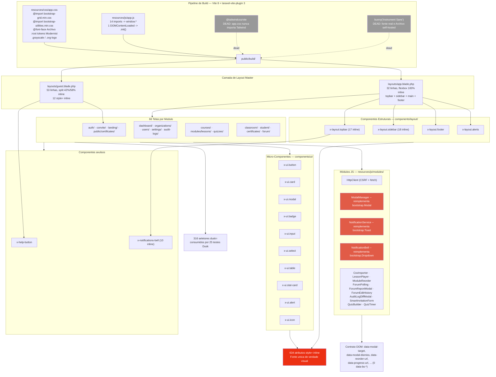

# 01 — Diagnóstico do Frontend Atual e Mapa Mental

> Documento base da migração. Descreve o **estado real medido** do frontend em
> 2026-08-12, não o estado documentado. Todas as métricas foram coletadas por
> varredura direta do repositório.

---

## 1. Resumo Executivo

O frontend da Plataforma EAD **não possui uma camada de CSS de componentes**.
O que as skills `frontend-architecture` / `frontend-conventions` descrevem
(classes `.btn-primary`, `.card`, `.dialog`, `.tag-accent`, `.field`, `.input`,
`.table`) **não existe em nenhum arquivo CSS do projeto**. Essas classes são
escritas no HTML mas caem no vazio.

Todo o estilo visual real é aplicado por **atributos `style="..."` inline**
espalhados pelas views — 634 ocorrências. O Bootstrap está instalado
(`bootstrap ^5.3.3`) mas somente as folhas **grid** e **utilities** são
importadas; o CSS de componentes do Bootstrap e **todo o JavaScript do
Bootstrap estão ausentes**. Consequentemente, 12 módulos JS artesanais
reimplementam à mão comportamentos que o Bootstrap entrega nativamente
(Modal, Toast, Dropdown, Alert dismiss, Progress).

A migração, portanto, **não é "trocar de framework"** — é **adotar de fato o
framework que já está no `package.json`**, eliminando a camada inline e a
camada JS redundante.

### Métricas do estado atual

| Métrica | Valor |
|---|---|
| Views Blade totais | **78** |
| Views de tela (exclui `components/` e `layouts/`) | 66 |
| Componentes Blade (`components/**`) | 14 |
| Layouts master | 2 (`app`, `guest`) |
| Atributos `style="` inline | **634** |
| Regras CSS de componente definidas em `app.css` | **0** |
| Seletores `dusk="..."` nas views | **316** |
| Atributos `data-bs-*` (Bootstrap JS) | **0** |
| Módulos JS em `resources/js/` | **14** (12 em `modules/` + 2 soltos) |
| Arquivos de teste Dusk | **25** |
| Rotas em `routes/web.php` | 95 |
| Dependências de runtime no `package.json` | 1 (`bootstrap`) |

---

## 2. Mapa Mental do Frontend



---

## 3. Camadas — Estado Atual em Detalhe

### 3.1 Camada de estilo (CSS)

`resources/css/app.css` — 2.8 KB, e é **todo** o CSS do projeto. Conteúdo:

1. `@import "bootstrap/dist/css/bootstrap-grid.min.css"` — apenas o grid.
2. `@import "bootstrap/dist/css/bootstrap-utilities.min.css"` — apenas utilities.
3. Três `@font-face` de **Archivo** self-hosted (400 / 600 / 800) em `/fonts/archivo/`.
4. Um bloco `:root` com os tokens do **Modernist Design System**:
   - Semânticos: `--color-bg #f3f2f2`, `--color-surface #eae9e9`,
     `--color-text #201e1d`, `--color-accent #ec3013`, `--color-accent-2 #e15b47`,
     `--color-divider`.
   - Rampas tonais 100–900: `--color-neutral-*`, `--color-accent-*`, `--color-accent-2-*`.
   - Tipografia: `--font-heading`/`--font-body` = Archivo, `--font-heading-weight: 800`.
   - Espaçamento: `--space-1..8` (4/8/12/16/24/32 px).
   - **Mandato de marca: `--radius-sm/md/lg` todos `0px`.**
   - Sombras: `--shadow-sm/md/lg` via `color-mix`.
5. `:focus-visible { outline: 2px solid var(--color-accent) }`.
6. `.grayscale { filter: grayscale(1) contrast(1.08) }` e a exceção `.org-logo`.

**Não há mais nada.** Nenhum seletor `.btn`, `.card`, `.modal`, `.table`,
`.field`, `.tag-*` é definido.

### 3.2 Onde o estilo realmente mora — 634 `style=` inline

Distribuição por arquivo (top 15):

| Arquivo | `style=` |
|---|---:|
| `audit-logs/index.blade.php` | 27 |
| `forum/show.blade.php` | 24 |
| `landing/show.blade.php` | 23 |
| `public/certificates/show.blade.php` | 21 |
| `modules/lessons/_form.blade.php` | 19 |
| `student/quizzes/show.blade.php` | 18 |
| `quizzes/partials/_question-form.blade.php` | 18 |
| `components/layout/sidebar.blade.php` | 18 |
| `classroom/show.blade.php` | 18 |
| `certificates/index.blade.php` | 18 |
| `components/layout/topbar.blade.php` | 17 |
| `courses/completion-rules/index.blade.php` | 15 |
| `courses/enrollments/index.blade.php` | 14 |
| `users/index.blade.php` | 13 |
| `organizations/index.blade.php` | 13 |

Até os **layouts master** estilizam inline — `layouts/app.blade.php` monta o
shell inteiro (flex column, flex row, `padding: 24px`) em atributos `style`, e
`layouts/guest.blade.php` monta o split-screen 42/58 com 12 blocos inline.

**Consequência prática:** especificidade de estilo inline (1000) **vence
qualquer classe utilitária do Bootstrap**. Isso significa que a migração
precisa **remover** os inline styles, não apenas adicionar classes — adicionar
classes por cima não terá efeito visual algum. Este é o risco #1 da migração.

### 3.3 Uso atual de classes

Contagem de classes que *parecem* Bootstrap nas views:

| Classe | Ocorrências | Situação |
|---|---:|---|
| `btn` | 53 | sem CSS — inerte |
| `btn-ghost` | 42 | sem CSS — inerte (nem existe no Bootstrap) |
| `modal` | 9 | sem CSS — inerte |
| `card` | 9 | sem CSS — inerte |
| `btn-primary` | 8 | sem CSS — inerte |
| `btn-icon` | 7 | sem CSS — inerte |
| `d-none` / `d-lg-flex` / `d-lg-none` / `d-sm-block` / `d-md-block` | 11 | **funcionam** (utilities) |
| `row` | 3 | **funciona** (grid) |
| `table`, `table-responsive` | 3 | sem CSS de componente — inerte |
| `badge`, `alert` | 3 | sem CSS — inerte |
| `text-muted`, `text-start` | 2 | **funcionam** (utilities) |

Ou seja: **apenas grid + utilities estão realmente ativos.** Todo o resto é
markup semanticamente correto mas visualmente morto, compensado por inline styles.

### 3.4 Camada JavaScript

`resources/js/app.js` instancia tudo em `window.*` e chama `.init()` num único
`DOMContentLoaded`. Sem code splitting, sem lazy load — todos os 14 módulos
carregam em todas as páginas.

| Módulo | Responsabilidade | Equivalente Bootstrap |
|---|---|---|
| `HttpClient` | fetch + CSRF + parsing de erro | **nenhum** — manter |
| `ModalManager` | modal, backdrop, Esc, foco, `data-modal-target` | **`bootstrap.Modal`** — substituir |
| `NotificationService` | toasts, container dinâmico, auto-dismiss | **`bootstrap.Toast`** — substituir |
| `NotificationBell` | dropdown do sino + polling de não-lidas | **`bootstrap.Dropdown`** (parte) |
| `AuditLogDiffModal` | modal de diff JSON | consome `bootstrap.Modal` |
| `ForumEditHistory` | modal de histórico | consome `bootstrap.Modal` |
| `ForumReportModal` | modal de denúncia | consome `bootstrap.Modal` |
| `ForumPolling` | polling de novas respostas | **nenhum** — manter |
| `ModuleReorder` | drag & drop de ordenação | **nenhum** — manter |
| `LessonPlayer` | player + threshold de conclusão | **nenhum** — manter |
| `CsvImporter` | parsing + upload + progresso | progresso -> `.progress-bar` |
| `SmartInvitationForm` | form dinâmico de convite | **nenhum** — manter |
| `QuizBuilder` | builder de questões/opções | **nenhum** — manter |
| `QuizTimer` | cronômetro da prova | UI -> `.progress` + `.badge` |

**Contrato DOM atual** (`data-*` proprietários, 0 `data-bs-*`):
`data-modal-target` (10), `data-modal-dismiss` (9), `data-invitation-field` (4),
`data-reorder-url` (3), `data-id` (3), `data-postable-type/-id` (2 cada),
`data-mark-complete-url` (2), e ~15 outros unitários.

### 3.5 Dívidas técnicas de dependência

- **Tailwind CSS 4 instalado e plugado no Vite, porém `app.css` nunca importa
  Tailwind.** Peso morto no build e na árvore de dependências.
- **`bunny('Instrument Sans')` no `vite.config.js`** enquanto o CSS declara e
  usa **Archivo** self-hosted. Fonte carregada e nunca usada.
- **`bootstrap` é a única dependência de runtime** e está subutilizada (2 de ~30
  módulos CSS, 0 de 13 plugins JS).

### 3.6 Superfície de teste — restrição dura

**316 seletores `dusk="..."`** nas views, consumidos por **25 arquivos de teste
Dusk** em `tests/Browser/`:

```
AuditLogUiTest · BladeComponentsTest · CertificateRevocationTest
CertificateVerificationTest · CourseCompletionRuleTest · CourseManagementTest
DashboardDuskTest · EssayGradingScreenTest · ExampleSmokeTest · ForumDuskTest
HelpCenterDuskTest · ImpersonateOrgTest · LayoutRenderingTest
LessonMultimediaTest · ModuleReorderTest · MultiOrgEnrollmentTest
MultiOrgStudentClassroomTest · MultiTenantStudentImportTest
NavigationMenuDuskTest · NotificationBellTest · OrganizationCrudTest
ProfileTest · StudentQuizAttemptTest · UserManagementTest
VideoThresholdCompletionTest
```

> **Regra inviolável da migração:** nenhum atributo `dusk="..."` pode ser
> renomeado ou removido. Ele é o contrato entre a view e a suíte de browser.
> Reestruturar markup é permitido; renomear seletor `dusk` não é.

Efeito colateral relevante: **Dusk roda contra `public/build/`**. Um build
desatualizado quebra os testes silenciosamente sem nenhuma alteração de código.
Toda tarefa de migração termina obrigatoriamente com
`vendor/bin/sail npm run build`.

---

## 4. Achados Críticos

| # | Achado | Impacto |
|---|---|---|
| **C1** | Especificidade: 634 inline styles vencem qualquer utility do Bootstrap | Migração deve **deletar** inline, não sobrepor. Sem isso, zero efeito visual. |
| **C2** | Skills `frontend-*` documentam classes CSS inexistentes | Documentação de apoio já está incorreta; precisa ser corrigida ou aposentada junto com a migração. |
| **C3** | Bootstrap JS ausente ⇒ `data-bs-*` inerte | Adotar `data-bs-toggle` **antes** de importar o bundle JS produz UI morta. Ordem de fases importa. |
| **C4** | `BUG-004-alert-dismiss-button-inert` em `spec/bugs/` | Provavelmente resolvido de graça ao adotar `bootstrap.Alert` + `.btn-close`. Validar e fechar durante a migração. |
| **C5** | `certificates/pdf.blade.php` é renderizado por **dompdf** | dompdf não interpreta CSS moderno. Este arquivo **não** recebe Bootstrap. Exceção explícita e obrigatória. |
| **C6** | Tailwind e a fonte bunny são peso morto | Remover no expurgo da Fase 0 reduz build e confusão. |
| **C7** | Mandato Modernist (radius 0, Archivo, `#ec3013`, sidebar escura, imagens grayscale) | Deve ser codificado como **override de variáveis SCSS do Bootstrap**, não como um sistema de tokens paralelo. |
| **C8** | `app.js` é arquivo compartilhado por todos os módulos JS | Serializa refatorações JS. Mitigação: registry `modules/index.js`. |
| **C9** | 3 módulos JS reimplementam Modal/Toast/Dropdown à mão | ~14 KB de JS deletável; ganho de acessibilidade nativa (focus trap, `aria-*`, backdrop stacking). |
| **C10** | **Diretivas Alpine.js (`x-data`, `x-show`, `x-cloak`, `@click`, `x-transition`) usadas em 5 arquivos — Alpine NÃO está instalado** (`package.json` não tem `alpinejs`) | Markup reativo totalmente inerte em `layouts/app.blade.php`, `components/layout/topbar.blade.php`, `components/layout/sidebar.blade.php`, `components/ui/modal.blade.php`, `components/ui/alert.blade.php`. Explica o **menu mobile morto** e o BUG-004. Bootstrap Offcanvas/Collapse/Modal/Alert substituem 1:1. |
| **C12** | **Paginação sem estilo em 9 telas** — nenhum `Paginator::useBootstrapFive()` em `app/` ou `config/`, então o Laravel serve o tema **Tailwind**, cujas classes não são carregadas | Corrigido na Fase 0 com uma linha em `AppServiceProvider::boot()`. Ganho visual imediato em 9 telas. |
| **C13** | **Drawer mobile do sidebar nunca abre** — `x-data="{ sidebarOpen: false }"` sem Alpine; `sidebarOpen` não existe em `resources/js` nem em `app/` | Navegação mobile quebrada em toda a área autenticada. Resolvido por `bootstrap.Offcanvas`. Bug novo, ainda não catalogado em `spec/bugs/`. |
| **C11** | **Os três `.woff2` de Archivo em `public/fonts/archivo/` têm 0 bytes** | `@font-face` falha; a plataforma inteira renderiza em `system-ui`. A tipografia da marca **nunca esteve ativa em produção**. Precisa de substituição dos arquivos, senão a migração não altera nada visualmente na tipografia. |

---

## 5. Princípios que Guiam a Migração

1. **Bootstrap SCSS é a fonte única de verdade de design.** Os tokens
   `--color-*` viram *inputs* das variáveis SCSS do Bootstrap, não um sistema
   paralelo.
2. **Zero `style=` inline no estado final.** Utility do Bootstrap primeiro;
   classe de componente própria só quando nenhuma utility expressa a regra.
3. **Zero JS artesanal para comportamento que o Bootstrap já entrega.**
4. **Componentização máxima.** Cada padrão repetido em ≥2 telas vira
   `<x-ui.*>` ou `<x-layout.*>`. Telas devem virar composição declarativa.
5. **`dusk=` é imutável.**
6. **Toda tarefa termina com build + Dusk filtrado verde.**

---

## 6. Documentos Relacionados

| Doc | Conteúdo |
|---|---|
| `00-index.md` | Índice, fases e sequenciamento |
| `02-component-inventory.md` | Inventário de componentes Blade + DE ↔ PARA |
| `03-screen-inventory.md` | Inventário das 66 telas + composição alvo |
| `04-js-and-build-pipeline.md` | Camada JS + pipeline SCSS/Vite alvo |
| `05-bootstrap-reference.md` | Referência canônica Bootstrap 5.3 |
| `06-skills-and-agents.md` | Skills e subagentes especializados |
| `07-migration-plan.md` | Plano faseado, tarefas e paralelização |
