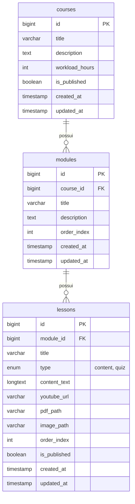
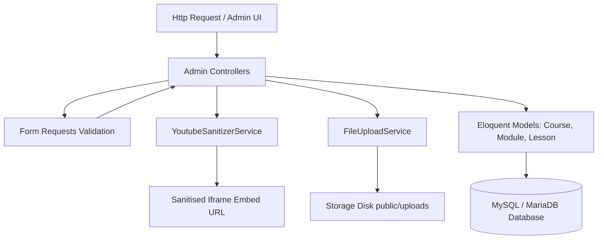

# **Especificação Técnica: Gestão de Cursos, Módulos e Conteúdos Multimídia**
**Módulo:** 02 - Cursos, Módulos e Conteúdos Multimídia  
**Arquivo de Referência:** `spec/specs/02-courses-modules-and-content-management.md`  
**Requisitos Cobertos:** RF06, RF07  
**Casos de Uso Cobertos:** UC05, UC06  
**Chaves de Ajuda:** `admin.courses.index`, `admin.courses.edit`, `admin.modules.index`, `admin.lessons.create`

---

## **1. Visão Geral e Objetivos do Módulo**

O módulo de **Gestão de Cursos, Módulos e Conteúdos Multimídia** é a espinha dorsal pedagógica da plataforma EAD. Seu objetivo principal é fornecer aos administradores uma interface fluida, responsiva e intuitiva para estruturar a oferta de ensino da instituição.

Através deste módulo, o administrador pode:
1. Cadastrar e gerenciar Cursos com controle de publicação (`is_published`), carga horária e descrição detalhada.
2. Organizar cada curso em Módulos ordenados sequencialmente, oferecendo suporte a reordenação dinâmica via drag-and-drop / requisições AJAX (jQuery).
3. Cadastrar Lições multimídia associadas a módulos, suportando quatro tipos primários de conteúdo:
   - **Texto em Rich Text (HTML sanitizado)**.
   - **Imagem (upload sanitizado e otimizado)**.
   - **Documento PDF (upload sanitizado com validação MIME e leitor incorporado)**.
   - **Vídeo do YouTube (sanitização rigorosa de URL, extração de Video ID e incorporação via player restrito)**.

Toda a arquitetura é projetada especificamente para operar em ambientes de hospedagem compartilhada (PHP 8.2+ e MySQL 8.0/MariaDB 10.4+), sem dependência de processos em segundo plano complexos, mantendo alta performance e segurança rigorosa.

---

## **2. Modelo de Dados e Migrações (Database Schema)**

A estrutura relacional para o gerenciamento de conteúdo é composta por três tabelas conectadas em hierarquia de cascata: `courses` -> `modules` -> `lessons`.



### **2.1. Estrutura das Migrações Laravel**

#### **Migração: `create_courses_table`**
```php
<?php

use Illuminate\Database\Migrations\Migration;
use Illuminate\Database\Schema\Blueprint;
use Illuminate\Support\Facades\Schema;

return new class extends Migration
{
    public function up(): void
    {
        Schema::create('courses', function (Blueprint $table) {
            $table->id();
            $table->string('title', 200);
            $table->text('description');
            $table->unsignedInteger('workload_hours')->default(0);
            $table->boolean('is_published')->default(false)->index();
            $table->timestamps();
        });
    }

    public function down(): void
    {
        Schema::dropIfExists('courses');
    }
};
```

#### **Migração: `create_modules_table`**
```php
<?php

use Illuminate\Database\Migrations\Migration;
use Illuminate\Database\Schema\Blueprint;
use Illuminate\Support\Facades\Schema;

return new class extends Migration
{
    public function up(): void
    {
        Schema::create('modules', function (Blueprint $table) {
            $table->id();
            $table->foreignId('course_id')->constrained('courses')->cascadeOnDelete();
            $table->string('title', 200);
            $table->text('description')->nullable();
            $table->unsignedInteger('order_index')->default(0)->index();
            $table->timestamps();

            $table->index(['course_id', 'order_index']);
        });
    }

    public function down(): void
    {
        Schema::dropIfExists('modules');
    }
};
```

#### **Migração: `create_lessons_table`**
```php
<?php

use Illuminate\Database\Migrations\Migration;
use Illuminate\Database\Schema\Blueprint;
use Illuminate\Support\Facades\Schema;

return new class extends Migration
{
    public function up(): void
    {
        Schema::create('lessons', function (Blueprint $table) {
            $table->id();
            $table->foreignId('module_id')->constrained('modules')->cascadeOnDelete();
            $table->string('title', 200);
            $table->enum('type', ['content', 'quiz'])->default('content');
            $table->longText('content_text')->nullable();
            $table->string('youtube_url', 255)->nullable();
            $table->string('pdf_path', 255)->nullable();
            $table->string('image_path', 255)->nullable();
            $table->unsignedInteger('order_index')->default(0)->index();
            $table->boolean('is_published')->default(true)->index();
            $table->timestamps();

            $table->index(['module_id', 'order_index']);
        });
    }

    public function down(): void
    {
        Schema::dropIfExists('lessons');
    }
};
```

---

## **3. Arquitetura de Componentes e Serviços Backend**

A arquitetura adota o padrão de isolamento de responsabilidades através de **Domain Services** dedicados para sanitização de URLs e manipulação de uploads.



### **3.1. Class Specification: `YoutubeSanitizerService`**

Serviço responsável por validar, sanitizar e extrair o ID do vídeo a partir de múltiplos formatos de URLs do YouTube, gerando a URL formatada para iframe seguro e restrito conforme a regra **RF07 / 2.3**.

```php
namespace App\Services;

use InvalidArgumentException;

class YoutubeSanitizerService
{
    /**
     * Padrões suportados:
     * - https://www.youtube.com/watch?v=VIDEO_ID
     * - https://youtube.com/watch?v=VIDEO_ID&feature=share
     * - https://youtu.be/VIDEO_ID
     * - https://www.youtube.com/embed/VIDEO_ID
     */
    private const YOUTUBE_REGEX = '/(?:youtube\.com\/(?:[^\/]+\/.+\/|(?:v|e(?:mbed)?)\/|.*[?&]v=)|youtu\.be\/)([^"&?\/\s]{11})/i';

    /**
     * Extrai o ID de 11 caracteres do vídeo do YouTube.
     */
    public function extractVideoId(string $url): ?string
    {
        if (preg_match(self::YOUTUBE_REGEX, trim($url), $matches)) {
            return $matches[1];
        }

        return null;
    }

    /**
     * Valida se a URL fornecida é um vídeo válido do YouTube.
     */
    public function isValidYoutubeUrl(string $url): bool
    {
        return $this->extractVideoId($url) !== null;
    }

    /**
     * Gera a URL sanitizada de embed para iframe com flags de restrição:
     * modestbranding=1&rel=0&controls=1&disablekb=1
     */
    public function generateEmbedUrl(string $url): string
    {
        $videoId = $this->extractVideoId($url);

        if (! $videoId) {
            throw new InvalidArgumentException('URL do YouTube inválida ou ID do vídeo não encontrado.');
        }

        return sprintf(
            'https://www.youtube-nocookie.com/embed/%s?modestbranding=1&rel=0&controls=1&disablekb=1',
            $videoId
        );
    }
}
```

### **3.2. Class Specification: `FileUploadService`**

Serviço encarregado do armazenamento, sanitização de nomes, validação de mimetype e exclusão de arquivos no disco `public`.

```php
namespace App\Services;

use Illuminate\Http\UploadedFile;
use Illuminate\Support\Facades\Storage;
use Illuminate\Support\Str;

class FileUploadService
{
    private const DISK = 'public';

    /**
     * Salva uma imagem enviada sanitizando o nome do arquivo.
     */
    public function uploadImage(UploadedFile $file, string $folder = 'courses/images'): string
    {
        $this->validateImage($file);
        $filename = sprintf('%s_%s.%s', time(), Str::random(10), $file->getClientOriginalExtension());
        
        return $file->storeAs($folder, $filename, self::DISK);
    }

    /**
     * Salva um documento PDF enviado sanitizando o nome do arquivo.
     */
    public function uploadPdf(UploadedFile $file, string $folder = 'courses/pdfs'): string
    {
        $this->validatePdf($file);
        $filename = sprintf('%s_%s.%s', time(), Str::random(10), $file->getClientOriginalExtension());

        return $file->storeAs($folder, $filename, self::DISK);
    }

    /**
     * Remove um arquivo antigo do storage caso exista.
     */
    public function deleteFile(?string $relativePath): bool
    {
        if ($relativePath && Storage::disk(self::DISK)->exists($relativePath)) {
            return Storage::disk(self::DISK)->delete($relativePath);
        }

        return false;
    }

    private function validateImage(UploadedFile $file): void
    {
        $allowedMimes = ['image/jpeg', 'image/png', 'image/webp'];
        if (! in_array($file->getMimeType(), $allowedMimes, true)) {
            throw new \InvalidArgumentException('Formato de imagem inválido. Permitiu-se apenas JPEG, PNG e WebP.');
        }
    }

    private function validatePdf(UploadedFile $file): void
    {
        if ($file->getMimeType() !== 'application/pdf') {
            throw new \InvalidArgumentException('O arquivo enviado deve ser obrigatoriamente um PDF.');
        }
    }
}
```

---

## **4. Estrutura de Rotas**

As rotas administrativas são agrupadas sob o prefixo `admin` e protegidas pelos middlewares `auth` e `can:admin-access`.

```php
use App\Http\Controllers\Admin\CourseController;
use App\Http\Controllers\Admin\ModuleController;
use App\Http\Controllers\Admin\LessonController;
use Illuminate\Support\Facades\Route;

Route::middleware(['auth', 'can:admin-access'])->prefix('admin')->name('admin.')->group(function () {
    
    // Cursos
    Route::resource('courses', CourseController::class);
    Route::patch('courses/{course}/toggle-publish', [CourseController::class, 'togglePublish'])
        ->name('courses.toggle-publish');

    // Módulos
    Route::prefix('courses/{course}')->group(function () {
        Route::get('modules', [ModuleController::class, 'index'])->name('modules.index');
        Route::post('modules', [ModuleController::class, 'store'])->name('modules.store');
        Route::put('modules/{module}', [ModuleController::class, 'update'])->name('modules.update');
        Route::delete('modules/{module}', [ModuleController::class, 'destroy'])->name('modules.destroy');
        Route::post('modules/reorder', [ModuleController::class, 'reorder'])->name('modules.reorder');
    });

    // Lições / Aulas
    Route::prefix('modules/{module}')->group(function () {
        Route::get('lessons', [LessonController::class, 'index'])->name('lessons.index');
        Route::get('lessons/create', [LessonController::class, 'create'])->name('lessons.create');
        Route::post('lessons', [LessonController::class, 'store'])->name('lessons.store');
        Route::get('lessons/{lesson}/edit', [LessonController::class, 'edit'])->name('lessons.edit');
        Route::put('lessons/{lesson}', [LessonController::class, 'update'])->name('lessons.update');
        Route::delete('lessons/{lesson}', [LessonController::class, 'destroy'])->name('lessons.destroy');
        Route::post('lessons/reorder', [LessonController::class, 'reorder'])->name('lessons.reorder');
    });
});
```

---

## **5. Form Requests & Controladores**

### **5.1. Form Requests**

#### `StoreCourseRequest.php` & `UpdateCourseRequest.php`
```php
namespace App\Http\Requests\Admin;

use Illuminate\Foundation\Http\FormRequest;

class StoreCourseRequest extends FormRequest
{
    public function authorize(): bool
    {
        return $this->user()->role === 'admin';
    }

    public function rules(): array
    {
        return [
            'title' => ['required', 'string', 'max:200'],
            'description' => ['required', 'string'],
            'workload_hours' => ['required', 'integer', 'min:1', 'max:1000'],
            'is_published' => ['sometimes', 'boolean'],
        ];
    }
}
```

#### `StoreModuleRequest.php` & `ReorderModulesRequest.php`
```php
namespace App\Http\Requests\Admin;

use Illuminate\Foundation\Http\FormRequest;

class ReorderModulesRequest extends FormRequest
{
    public function authorize(): bool
    {
        return $this->user()->role === 'admin';
    }

    public function rules(): array
    {
        return [
            'ordered_ids' => ['required', 'array'],
            'ordered_ids.*' => ['required', 'integer', 'exists:modules,id'],
        ];
    }
}
```

#### `StoreLessonRequest.php`
```php
namespace App\Http\Requests\Admin;

use Illuminate\Foundation\Http\FormRequest;

class StoreLessonRequest extends FormRequest
{
    public function authorize(): bool
    {
        return $this->user()->role === 'admin';
    }

    public function rules(): array
    {
        return [
            'title' => ['required', 'string', 'max:200'],
            'type' => ['required', 'in:content,quiz'],
            'content_text' => ['nullable', 'string'],
            'youtube_url' => ['nullable', 'url', 'max:255'],
            'pdf_file' => ['nullable', 'file', 'mimes:pdf', 'max:10240'], // 10MB max
            'image_file' => ['nullable', 'file', 'mimes:jpg,jpeg,png,webp', 'max:5120'], // 5MB max
            'is_published' => ['sometimes', 'boolean'],
        ];
    }
}
```

---

### **5.2. Controladores Administrativos**

#### **`CourseController.php`**
```php
namespace App\Http\Controllers\Admin;

use App\Http\Controllers\Controller;
use App\Http\Requests\Admin\StoreCourseRequest;
use App\Http\Requests\Admin\UpdateCourseRequest;
use App\Models\Course;
use Illuminate\Http\RedirectResponse;
use Illuminate\View\View;

class CourseController extends Controller
{
    public function index(): View
    {
        $courses = Course::withCount(['modules', 'enrollments'])
            ->latest()
            ->paginate(15);

        return view('admin.courses.index', compact('courses'));
    }

    public function create(): View
    {
        return view('admin.courses.create');
    }

    public function store(StoreCourseRequest $request): RedirectResponse
    {
        $course = Course::create($request->validated());

        return redirect()
            ->route('admin.courses.index')
            ->with('success', "Curso '{$course->title}' criado com sucesso.");
    }

    public function edit(Course $course): View
    {
        return view('admin.courses.edit', compact('course'));
    }

    public function update(UpdateCourseRequest $request, Course $course): RedirectResponse
    {
        $course->update($request->validated());

        return redirect()
            ->route('admin.courses.index')
            ->with('success', "Curso '{$course->title}' atualizado com sucesso.");
    }

    public function destroy(Course $course): RedirectResponse
    {
        $title = $course->title;
        $course->delete();

        return redirect()
            ->route('admin.courses.index')
            ->with('success', "Curso '{$title}' removido com sucesso.");
    }

    public function togglePublish(Course $course): RedirectResponse
    {
        $course->update(['is_published' => ! $course->is_published]);
        $status = $course->is_published ? 'publicado' : 'despublicado';

        return back()->with('success', "Status do curso alterado para {$status}.");
    }
}
```

#### **`ModuleController.php`**
```php
namespace App\Http\Controllers\Admin;

use App\Http\Controllers\Controller;
use App\Http\Requests\Admin\ReorderModulesRequest;
use App\Http\Requests\Admin\StoreModuleRequest;
use App\Http\Requests\Admin\UpdateModuleRequest;
use App\Models\Course;
use App\Models\Module;
use Illuminate\Http\JsonResponse;
use Illuminate\Http\RedirectResponse;
use Illuminate\Support\Facades\DB;
use Illuminate\View\View;

class ModuleController extends Controller
{
    public function index(Course $course): View
    {
        $modules = $course->modules()->withCount('lessons')->orderBy('order_index')->get();

        return view('admin.modules.index', compact('course', 'modules'));
    }

    public function store(StoreModuleRequest $request, Course $course): RedirectResponse
    {
        $maxOrder = $course->modules()->max('order_index') ?? 0;
        
        $course->modules()->create([
            'title' => $request->validated('title'),
            'description' => $request->validated('description'),
            'order_index' => $maxOrder + 1,
        ]);

        return back()->with('success', 'Módulo adicionado com sucesso.');
    }

    public function update(UpdateModuleRequest $request, Course $course, Module $module): RedirectResponse
    {
        $module->update($request->validated());

        return back()->with('success', 'Módulo atualizado com sucesso.');
    }

    public function destroy(Course $course, Module $module): RedirectResponse
    {
        $module->delete();

        return back()->with('success', 'Módulo removido com sucesso.');
    }

    public function reorder(ReorderModulesRequest $request, Course $course): JsonResponse
    {
        $orderedIds = $request->validated('ordered_ids');

        DB::transaction(function () use ($orderedIds, $course) {
            foreach ($orderedIds as $index => $id) {
                Module::where('id', $id)
                    ->where('course_id', $course->id)
                    ->update(['order_index' => $index + 1]);
            }
        });

        return response()->json([
            'status' => 'success',
            'message' => 'Ordem dos módulos atualizada com sucesso.',
        ]);
    }
}
```

#### **`LessonController.php`**
```php
namespace App\Http\Controllers\Admin;

use App\Http\Controllers\Controller;
use App\Http\Requests\Admin\StoreLessonRequest;
use App\Http\Requests\Admin\UpdateLessonRequest;
use App\Models\Lesson;
use App\Models\Module;
use App\Services\FileUploadService;
use App\Services\YoutubeSanitizerService;
use Illuminate\Http\RedirectResponse;
use Illuminate\View\View;

class LessonController extends Controller
{
    public function __construct(
        protected FileUploadService $fileUploadService,
        protected YoutubeSanitizerService $youtubeSanitizerService
    ) {}

    public function create(Module $module): View
    {
        $course = $module->course;
        return view('admin.lessons.create', compact('module', 'course'));
    }

    public function store(StoreLessonRequest $request, Module $module): RedirectResponse
    {
        $data = $request->validated();
        
        if (! empty($data['youtube_url'])) {
            $data['youtube_url'] = $this->youtubeSanitizerService->generateEmbedUrl($data['youtube_url']);
        }

        if ($request->hasFile('pdf_file')) {
            $data['pdf_path'] = $this->fileUploadService->uploadPdf($request->file('pdf_file'));
        }

        if ($request->hasFile('image_file')) {
            $data['image_path'] = $this->fileUploadService->uploadImage($request->file('image_file'));
        }

        $maxOrder = $module->lessons()->max('order_index') ?? 0;
        $data['order_index'] = $maxOrder + 1;

        $module->lessons()->create($data);

        return redirect()
            ->route('admin.modules.index', $module->course_id)
            ->with('success', 'Lição cadastrada com sucesso.');
    }

    public function edit(Module $module, Lesson $lesson): View
    {
        $course = $module->course;
        return view('admin.lessons.edit', compact('module', 'lesson', 'course'));
    }

    public function update(UpdateLessonRequest $request, Module $module, Lesson $lesson): RedirectResponse
    {
        $data = $request->validated();

        if (! empty($data['youtube_url'])) {
            $data['youtube_url'] = $this->youtubeSanitizerService->generateEmbedUrl($data['youtube_url']);
        }

        if ($request->hasFile('pdf_file')) {
            $this->fileUploadService->deleteFile($lesson->pdf_path);
            $data['pdf_path'] = $this->fileUploadService->uploadPdf($request->file('pdf_file'));
        }

        if ($request->hasFile('image_file')) {
            $this->fileUploadService->deleteFile($lesson->image_path);
            $data['image_path'] = $this->fileUploadService->uploadImage($request->file('image_file'));
        }

        $lesson->update($data);

        return redirect()
            ->route('admin.modules.index', $module->course_id)
            ->with('success', 'Lição atualizada com sucesso.');
    }

    public function destroy(Module $module, Lesson $lesson): RedirectResponse
    {
        $this->fileUploadService->deleteFile($lesson->pdf_path);
        $this->fileUploadService->deleteFile($lesson->image_path);
        $lesson->delete();

        return back()->with('success', 'Lição excluída com sucesso.');
    }
}
```

---

## **6. Blade Views & Interações com jQuery**

### **6.1. Componente da Central de Ajuda Contextual (`resources/views/partials/help-button.blade.php`)**
Todas as páginas operacionais renderizam o botão contextual da Central de Ajuda usando a chave da página correspondente (**RN05 / RF12**):

```html
@props(['pageKey'])

<a href="{{ route('help.show', ['target_page_key' => $pageKey]) }}" 
   class="btn btn-outline-info btn-sm rounded-pill d-inline-flex align-items-center gap-1"
   title="Ajuda para esta tela">
    <i class="bi bi-question-circle-fill"></i>
    <span>Ajuda</span>
</a>
```

---

### **6.2. Gerenciamento de Módulos com Reordenação AJAX (`admin/modules/index.blade.php`)**

Chave da Central de Ajuda: `admin.modules.index`

```html
@extends('layouts.admin')

@section('content')
<div class="container-fluid py-4">
    <div class="d-flex justify-content-between align-items-center mb-4">
        <div>
            <h1 class="h3 font-weight-bold text-gray-800">Módulos do Curso: {{ $course->title }}</h1>
            <p class="text-muted">Arraste ou ordene os módulos conforme a sequência desejada.</p>
        </div>
        <div class="d-flex gap-2">
            @include('partials.help-button', ['pageKey' => 'admin.modules.index'])
            <button class="btn btn-primary" data-bs-toggle="modal" data-bs-target="#createModuleModal">
                <i class="bi bi-plus-lg"></i> Novo Módulo
            </button>
        </div>
    </div>

    <!-- Lista de Módulos para Reordenação AJAX -->
    <div class="card shadow">
        <div class="card-body">
            <ul id="modulesSortableList" class="list-group list-group-flush">
                @forelse($modules as $module)
                    <li class="list-group-item d-flex justify-content-between align-items-center module-item py-3" data-id="{{ $module->id }}">
                        <div class="d-flex align-items-center gap-3">
                            <span class="drag-handle text-secondary style-grab" style="cursor: move;">
                                <i class="bi bi-grip-vertical fs-4"></i>
                            </span>
                            <div>
                                <h6 class="mb-0 font-weight-bold">{{ $module->title }}</h6>
                                <small class="text-muted">{{ $module->lessons_count }} Lições vinculadas</small>
                            </div>
                        </div>
                        <div class="btn-group">
                            <a href="{{ route('admin.lessons.create', $module->id) }}" class="btn btn-sm btn-outline-success">
                                <i class="bi bi-plus-circle"></i> Add Lição
                            </a>
                            <button class="btn btn-sm btn-outline-primary btn-edit-module" 
                                    data-id="{{ $module->id }}" 
                                    data-title="{{ $module->title }}" 
                                    data-description="{{ $module->description }}">
                                Editar
                            </button>
                            <form action="{{ route('admin.modules.destroy', [$course->id, $module->id]) }}" method="POST" class="d-inline" onsubmit="return confirm('Deseja realmente excluir este módulo?');">
                                @csrf
                                @method('DELETE')
                                <button type="submit" class="btn btn-sm btn-outline-danger">Excluir</button>
                            </form>
                        </div>
                    </li>
                @empty
                    <li class="list-group-item text-center py-4 text-muted">
                        Nenhum módulo cadastrado até o momento.
                    </li>
                @endforelse
            </ul>
        </div>
    </div>
</div>

@push('scripts')
<script src="https://code.jquery.com/jquery-3.7.1.min.js"></script>
<script src="https://cdn.jsdelivr.net/npm/sortablejs@1.15.0/Sortable.min.js"></script>
<script>
$(document).ready(function() {
    var el = document.getElementById('modulesSortableList');
    if (el) {
        new Sortable(el, {
            handle: '.drag-handle',
            animation: 150,
            onEnd: function (evt) {
                var orderedIds = [];
                $('#modulesSortableList .module-item').each(function() {
                    orderedIds.push($(this).data('id'));
                });

                $.ajax({
                    url: "{{ route('admin.modules.reorder', $course->id) }}",
                    method: 'POST',
                    headers: {
                        'X-CSRF-TOKEN': '{{ csrf_token() }}'
                    },
                    contentType: 'application/json',
                    data: JSON.stringify({ ordered_ids: orderedIds }),
                    success: function(response) {
                        toastr.success(response.message);
                    },
                    error: function(xhr) {
                        toastr.error('Erro ao reordenar módulos. Tente novamente.');
                    }
                });
            }
        });
    }
});
</script>
@endpush
@endsection
```

---

### **6.3. Cadastro de Lições Multimídia (`admin/lessons/create.blade.php`)**

Chave da Central de Ajuda: `admin.lessons.create`

```html
@extends('layouts.admin')

@section('content')
<div class="container py-4">
    <div class="d-flex justify-content-between align-items-center mb-4">
        <h2>Cadastrar Lição: Módulo "{{ $module->title }}"</h2>
        @include('partials.help-button', ['pageKey' => 'admin.lessons.create'])
    </div>

    <form action="{{ route('admin.lessons.store', $module->id) }}" method="POST" enctype="multipart/form-data">
        @csrf
        
        <div class="card shadow-sm mb-4">
            <div class="card-body">
                <div class="mb-3">
                    <label for="title" class="form-label">Título da Lição</label>
                    <input type="text" name="title" id="title" class="form-control @error('title') is-invalid @enderror" value="{{ old('title') }}" required>
                </div>

                <div class="mb-3">
                    <label for="media_type_selector" class="form-label">Tipo de Conteúdo / Mídia</label>
                    <select id="media_type_selector" class="form-select">
                        <option value="text">Apenas Texto (Rich Text)</option>
                        <option value="video">Vídeo do YouTube</option>
                        <option value="pdf">Documento PDF</option>
                        <option value="image">Imagem Ilustrativa</option>
                    </select>
                </div>

                <!-- Campo Rich Text -->
                <div class="mb-3 media-field" id="field_text">
                    <label for="content_text" class="form-label">Conteúdo em Texto</label>
                    <textarea name="content_text" id="content_text" class="form-control rows-6">{{ old('content_text') }}</textarea>
                </div>

                <!-- Campo Vídeo YouTube -->
                <div class="mb-3 media-field d-none" id="field_video">
                    <label for="youtube_url" class="form-label">URL do Vídeo no YouTube</label>
                    <input type="url" name="youtube_url" id="youtube_url" class="form-control" placeholder="https://www.youtube.com/watch?v=XXXXXX">
                    <small class="text-muted">O link será sanitizado e incorporado com o player restrito sem recomendações externas.</small>
                </div>

                <!-- Campo PDF Upload -->
                <div class="mb-3 media-field d-none" id="field_pdf">
                    <label for="pdf_file" class="form-label">Upload de Documento PDF (Máx 10MB)</label>
                    <input type="file" name="pdf_file" id="pdf_file" class="form-control" accept="application/pdf">
                </div>

                <!-- Campo Imagem Upload -->
                <div class="mb-3 media-field d-none" id="field_image">
                    <label for="image_file" class="form-label">Upload de Imagem (JPG, PNG, WebP - Máx 5MB)</label>
                    <input type="file" name="image_file" id="image_file" class="form-control" accept="image/jpeg,image/png,image/webp">
                </div>
            </div>
            <div class="card-footer d-flex justify-content-between">
                <a href="{{ route('admin.modules.index', $module->course_id) }}" class="btn btn-secondary">Cancelar</a>
                <button type="submit" class="btn btn-primary">Salvar Lição</button>
            </div>
        </div>
    </form>
</div>

@push('scripts')
<script>
$(document).ready(function() {
    $('#media_type_selector').on('change', function() {
        var selected = $(this).val();
        $('.media-field').addClass('d-none');

        if (selected === 'text') $('#field_text').removeClass('d-none');
        if (selected === 'video') { $('#field_text').removeClass('d-none'); $('#field_video').removeClass('d-none'); }
        if (selected === 'pdf') { $('#field_text').removeClass('d-none'); $('#field_pdf').removeClass('d-none'); }
        if (selected === 'image') { $('#field_text').removeClass('d-none'); $('#field_image').removeClass('d-none'); }
    });
});
</script>
@endpush
@endsection
```

---

## **7. Estratégia de Testes Automatizados (95%+ Cobertura)**

Em total alinhamento com a regra **RN06 / RNF03**, o código deve ser coberto por testes Unitários, de Integração e de Ponta a Ponta (E2E). Conforme a diretriz do projeto:
- Mocks devem isolar dependências externas ou estáticas (Mockery alias).
- Cada teste unitário foca exclusivamente em seu componente.

### **7.1. Teste Unitário: `YoutubeSanitizerServiceTest.php`**

```php
namespace Tests\Unit\Services;

use App\Services\YoutubeSanitizerService;
use InvalidArgumentException;
use PHPUnit\Framework\TestCase;

class YoutubeSanitizerServiceTest extends TestCase
{
    private YoutubeSanitizerService $service;

    protected function setUp(): void
    {
        parent::setUp();
        $this->service = new YoutubeSanitizerService();
    }

    public function test_extracts_video_id_from_standard_url(): void
    {
        $url = 'https://www.youtube.com/watch?v=dQw4w9WgXcQ';
        $this->assertEquals('dQw4w9WgXcQ', $this->service->extractVideoId($url));
    }

    public function test_extracts_video_id_from_shortened_url(): void
    {
        $url = 'https://youtu.be/dQw4w9WgXcQ';
        $this->assertEquals('dQw4w9WgXcQ', $this->service->extractVideoId($url));
    }

    public function test_extracts_video_id_from_embed_url(): void
    {
        $url = 'https://www.youtube.com/embed/dQw4w9WgXcQ';
        $this->assertEquals('dQw4w9WgXcQ', $this->service->extractVideoId($url));
    }

    public function test_generates_restricted_embed_url(): void
    {
        $url = 'https://www.youtube.com/watch?v=dQw4w9WgXcQ';
        $expected = 'https://www.youtube-nocookie.com/embed/dQw4w9WgXcQ?modestbranding=1&rel=0&controls=1&disablekb=1';
        
        $this->assertEquals($expected, $this->service->generateEmbedUrl($url));
    }

    public function test_throws_exception_on_invalid_url(): void
    {
        $this->expectException(InvalidArgumentException::class);
        $this->service->generateEmbedUrl('https://example.com/invalid-video');
    }
}
```

### **7.2. Teste de Integração: `ModuleReorderTest.php`**

```php
namespace Tests\Feature\Admin;

use App\Models\Course;
use App\Models\Module;
use App\Models\User;
use Illuminate\Foundation\Testing\RefreshDatabase;
use Tests\TestCase;

class ModuleReorderTest extends TestCase
{
    use RefreshDatabase;

    public function test_admin_can_reorder_modules_via_ajax(): void
    {
        $admin = User::factory()->create(['role' => 'admin']);
        $course = Course::factory()->create();

        $module1 = Module::factory()->create(['course_id' => $course->id, 'order_index' => 1]);
        $module2 = Module::factory()->create(['course_id' => $course->id, 'order_index' => 2]);
        $module3 = Module::factory()->create(['course_id' => $course->id, 'order_index' => 3]);

        $response = $this->actingAs($admin)
            ->postJson(route('admin.modules.reorder', $course->id), [
                'ordered_ids' => [$module3->id, $module1->id, $module2->id],
            ]);

        $response->assertOk()
            ->assertJson(['status' => 'success']);

        $this->assertDatabaseHas('modules', ['id' => $module3->id, 'order_index' => 1]);
        $this->assertDatabaseHas('modules', ['id' => $module1->id, 'order_index' => 2]);
        $this->assertDatabaseHas('modules', ['id' => $module2->id, 'order_index' => 3]);
    }
}
```

---

## **8. Lista Passo a Passo de Tarefas de Desenvolvimento**

- [ ] **1. Migrações e Models Base**
  - [ ] Criar migração e Model `Course` com campos e relacionamentos.
  - [ ] Criar migração e Model `Module` com suporte a `order_index`.
  - [ ] Criar migração e Model `Lesson` com os 4 tipos de mídia.
  - [ ] Executar migrações via `vendor/bin/sail artisan migrate`.

- [ ] **2. Domain Services**
  - [ ] Implementar `YoutubeSanitizerService` com regex e suporte a flags de segurança.
  - [ ] Implementar `FileUploadService` para imagens e PDFs.
  - [ ] Escrever suíte de testes unitários para os serviços com 100% de cobertura.

- [ ] **3. Controllers & Form Requests Administrativos**
  - [ ] Criar `StoreCourseRequest`, `UpdateCourseRequest`, `StoreModuleRequest`, `StoreLessonRequest`.
  - [ ] Implementar `Admin\CourseController` com toggle de publicação.
  - [ ] Implementar `Admin\ModuleController` com endpoint AJAX `reorder`.
  - [ ] Implementar `Admin\LessonController` integrado aos Domain Services.

- [ ] **4. Blade Views & jQuery**
  - [ ] Criar partial `partials/help-button.blade.php`.
  - [ ] Criar `admin/courses/index.blade.php` e `create.blade.php`.
  - [ ] Criar `admin/modules/index.blade.php` com integração SortableJS/jQuery AJAX.
  - [ ] Criar `admin/lessons/create.blade.php` e `edit.blade.php` com comutação dinâmica de campos.

- [ ] **5. Suíte de Testes Automatizados**
  - [ ] Escrever testes de integração para CRUD de Cursos e Módulos.
  - [ ] Escrever teste de integração para o endpoint de reordenação AJAX.
  - [ ] Escrever testes E2E (Dusk/Cypress) simulando cadastro de lição em vídeo e PDF.
  - [ ] Executar audit de cobertura (`vendor/bin/sail artisan test --coverage`) validando meta de 95%+.
