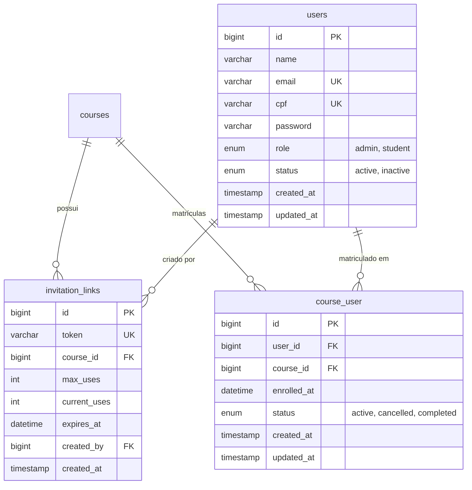
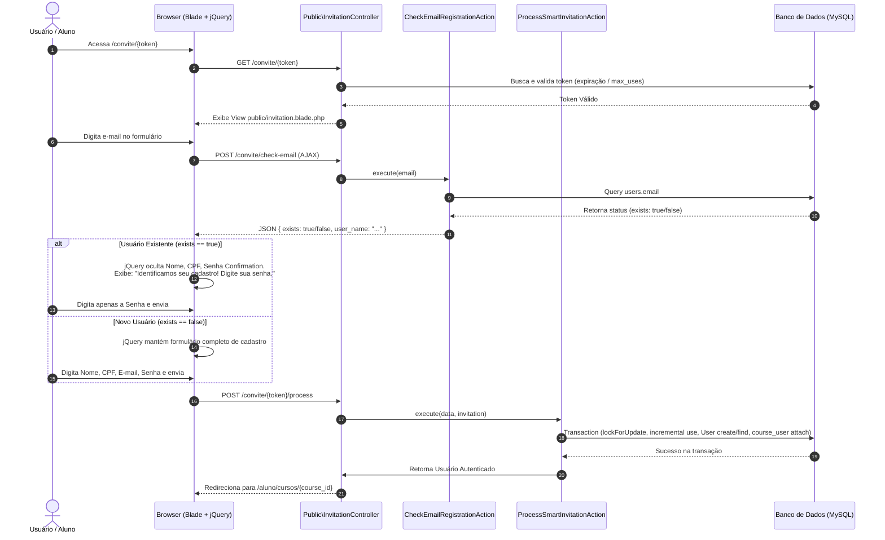

# **Especificação Técnica: Sistema Inteligente de Convites e Gestão de Matrículas**
**Módulo:** 03 - Convites Inteligentes e Matrículas  
**Arquivo de Referência:** `spec/specs/03-smart-invitation-and-enrollment-system.md`  
**Requisitos Cobertos:** RF03, RF21  
**Regras de Negócio Cobertas:** RN09  
**Casos de Uso Cobertos:** UC03, UC04  
**Chaves de Ajuda:** `admin.invitations.index`, `public.invitation`

---

## **1. Visão Geral e Objetivos do Módulo**

O módulo **Sistema Inteligente de Convites e Gestão de Matrículas** é responsável pela porta de entrada otimizada dos alunos na plataforma EAD. Desenvolvido para maximizar a conversão de inscrições e eliminar atritos de navegação, ele introduz o conceito de **Convites Inteligentes Adaptativos (`/convite/{token}`)**.

O fluxo inteligente resolve um desafio clássico de plataformas de capacitação:
- **Novos Alunos:** Apresenta um formulário completo de cadastro (Nome, CPF, E-mail, Senha). Ao submeter, cria o usuário na tabela `users`, efetua a matrícula no curso em `course_user`, realiza o auto-login e redireciona para a área de estudos.
- **Alunos Existentes (RN09):** Ao digitar o e-mail no formulário do convite, uma verificação assíncrona via AJAX (`CheckEmailRegistrationAction`) detecta a conta existente. O formulário se adapta dinamicamente via jQuery, ocultando campos desnecessários e solicitando **apenas a senha** do usuário. Após a validação da senha, a nova matrícula é vinculada imediatamente na tabela `course_user` **sem duplicar o cadastro do usuário**, redirecionando-o para o novo curso.

Adicionalmente, o módulo fornece aos administradores ferramentas completas para geração de links temporários com limite de uso/expiração e gestão manual de matrículas (inclusão/remoção direta de alunos em cursos).

---

## **2. Modelo de Dados e Migrações (Database Schema)**

O modelo relacional suporta links com limitação temporária/quantitativa e uma tabela pivot restritiva com chave única composta.



### **2.1. Estrutura das Migrações Laravel**

#### **Migração: `create_invitation_links_table`**
```php
<?php

use Illuminate\Database\Migrations\Migration;
use Illuminate\Database\Schema\Blueprint;
use Illuminate\Support\Facades\Schema;

return new class extends Migration
{
    public function up(): void
    {
        Schema::create('invitation_links', function (Blueprint $table) {
            $table->id();
            $table->string('token', 64)->unique();
            $table->foreignId('course_id')->constrained('courses')->cascadeOnDelete();
            $table->unsignedInteger('max_uses')->default(0); // 0 = ilimitado
            $table->unsignedInteger('current_uses')->default(0);
            $table->dateTime('expires_at')->nullable();
            $table->foreignId('created_by')->constrained('users');
            $table->timestamps();

            $table->index(['token', 'expires_at']);
        });
    }

    public function down(): void
    {
        Schema::dropIfExists('invitation_links');
    }
};
```

#### **Migração: `create_course_user_table`**
```php
<?php

use Illuminate\Database\Migrations\Migration;
use Illuminate\Database\Schema\Blueprint;
use Illuminate\Support\Facades\Schema;

return new class extends Migration
{
    public function up(): void
    {
        Schema::create('course_user', function (Blueprint $table) {
            $table->id();
            $table->foreignId('user_id')->constrained('users')->cascadeOnDelete();
            $table->foreignId('course_id')->constrained('courses')->cascadeOnDelete();
            $table->dateTime('enrolled_at');
            $table->enum('status', ['active', 'cancelled', 'completed'])->default('active');
            $table->timestamps();

            // Garantia de unicidade da matrícula
            $table->unique(['user_id', 'course_id']);
        });
    }

    public function down(): void
    {
        Schema::dropIfExists('course_user');
    }
};
```

---

## **3. Fluxo Sequencial da Arquitetura do Convite Inteligente**



---

## **4. Actions & Domain Services**

### **4.1. `CheckEmailRegistrationAction.php`**
Action de consulta assíncrona responsável por averiguar a existência do e-mail digitado.

```php
namespace App\Actions\Invitation;

use App\Models\User;

class CheckEmailRegistrationAction
{
    /**
     * Retorna array com status da conta e nome formatado para recepção.
     */
    public function execute(string $email): array
    {
        $user = User::where('email', strtolower(trim($email)))->first();

        if ($user) {
            return [
                'exists' => true,
                'name' => $user->name,
                'message' => 'Identificamos seu cadastro! Digite sua senha para se matricular neste novo curso.',
            ];
        }

        return [
            'exists' => false,
            'name' => null,
            'message' => 'Novo por aqui? Preencha seus dados para criar sua conta.',
        ];
    }
}
```

### **4.2. `ProcessSmartInvitationAction.php`**
Action transacional segura que executa a matrícula prevenindo *race conditions* (condições de corrida no limite de usos).

```php
namespace App\Actions\Invitation;

use App\Models\CourseUser;
use App\Models\InvitationLink;
use App\Models\User;
use Illuminate\Support\Facades\Auth;
use Illuminate\Support\Facades\DB;
use Illuminate\Support\Facades\Hash;
use ValidationException;

class ProcessSmartInvitationAction
{
    public function execute(array $data, InvitationLink $invitation): User
    {
        return DB::transaction(function () use ($data, $invitation) {
            // Lock for update para prevenir race condition no limite de usos
            $invitation = InvitationLink::where('id', $invitation->id)->lockForUpdate()->first();

            if ($invitation->isExpired()) {
                throw new \DomainException('Este link de convite expirou.');
            }

            if ($invitation->isLimitReached()) {
                throw new \DomainException('Este link de convite atingiu o limite máximo de utilizações.');
            }

            $email = strtolower(trim($data['email']));
            $user = User::where('email', $email)->first();

            if ($user) {
                // Usuário Existente (RN09) - Validação rigorosa da senha
                if (! Hash::check($data['password'], $user->password)) {
                    throw new \InvalidArgumentException('Senha incorreta. Por favor, tente novamente.');
                }
            } else {
                // Novo Usuário - Cadastro completo
                $user = User::create([
                    'name' => $data['name'],
                    'email' => $email,
                    'cpf' => preg_replace('/\D/', '', $data['cpf'] ?? ''),
                    'password' => Hash::make($data['password']),
                    'role' => 'student',
                    'status' => 'active',
                ]);
            }

            // Realiza a vinculação em course_user caso ainda não esteja matriculado
            $alreadyEnrolled = CourseUser::where('user_id', $user->id)
                ->where('course_id', $invitation->course_id)
                ->exists();

            if (! $alreadyEnrolled) {
                CourseUser::create([
                    'user_id' => $user->id,
                    'course_id' => $invitation->course_id,
                    'enrolled_at' => now(),
                    'status' => 'active',
                ]);

                // Incrementa contador de usos atomicamente
                $invitation->increment('current_uses');
            }

            // Auto-login do usuário
            Auth::login($user);

            return $user;
        });
    }
}
```

---

## **5. Estrutura de Rotas**

```php
use App\Http\Controllers\Admin\EnrollmentController;
use App\Http\Controllers\Admin\InvitationLinkController;
use App\Http\Controllers\Public\InvitationController;
use Illuminate\Support\Facades\Route;

// Rotas Públicas de Convite Inteligente
Route::prefix('convite')->name('invitation.')->group(function () {
    Route::get('{token}', [InvitationController::class, 'show'])->name('show');
    Route::post('check-email', [InvitationController::class, 'checkEmail'])->name('check-email');
    Route::post('{token}/process', [InvitationController::class, 'process'])->name('process');
});

// Rotas Administrativas de Gestão de Convites e Matrículas
Route::middleware(['auth', 'can:admin-access'])->prefix('admin')->name('admin.')->group(function () {
    // Links de Convite
    Route::resource('invitations', InvitationLinkController::class)->only(['index', 'store', 'destroy']);
    
    // Gestão Manual de Matrículas (RF21)
    Route::get('enrollments', [EnrollmentController::class, 'index'])->name('enrollments.index');
    Route::post('enrollments', [EnrollmentController::class, 'store'])->name('enrollments.store');
    Route::delete('enrollments/{enrollment}', [EnrollmentController::class, 'destroy'])->name('enrollments.destroy');
});
```

---

## **6. Controladores & Form Requests**

### **6.1. Form Requests**

#### `CheckEmailRequest.php`
```php
namespace App\Http\Requests\Invitation;

use Illuminate\Foundation\Http\FormRequest;

class CheckEmailRequest extends FormRequest
{
    public function authorize(): bool
    {
        return true;
    }

    public function rules(): array
    {
        return [
            'email' => ['required', 'email', 'max:150'],
        ];
    }
}
```

#### `ProcessInvitationRequest.php`
```php
namespace App\Http\Requests\Invitation;

use App\Models\User;
use Illuminate\Foundation\Http\FormRequest;

class ProcessInvitationRequest extends FormRequest
{
    public function authorize(): bool
    {
        return true;
    }

    public function rules(): array
    {
        $email = strtolower(trim($this->input('email')));
        $userExists = User::where('email', $email)->exists();

        // Se o usuário existe (RN09), requer apenas e-mail e senha
        if ($userExists) {
            return [
                'email' => ['required', 'email', 'max:150'],
                'password' => ['required', 'string'],
            ];
        }

        // Se o usuário não existe, exige cadastro completo
        return [
            'name' => ['required', 'string', 'max:150'],
            'email' => ['required', 'email', 'max:150', 'unique:users,email'],
            'cpf' => ['required', 'string', 'max:14', 'unique:users,cpf'],
            'password' => ['required', 'string', 'min:8', 'confirmed'],
        ];
    }
}
```

---

### **6.2. Controladores**

#### **`Public\InvitationController.php`**
```php
namespace App\Http\Controllers\Public;

use App\Actions\Invitation\CheckEmailRegistrationAction;
use App\Actions\Invitation\ProcessSmartInvitationAction;
use App\Http\Controllers\Controller;
use App\Http\Requests\Invitation\CheckEmailRequest;
use App\Http\Requests\Invitation\ProcessInvitationRequest;
use App\Models\InvitationLink;
use Illuminate\Http\JsonResponse;
use Illuminate\Http\RedirectResponse;
use Illuminate\View\View;

class InvitationController extends Controller
{
    public function show(string $token): View
    {
        $invitation = InvitationLink::where('token', $token)->firstOrFail();

        if ($invitation->isExpired() || $invitation->isLimitReached()) {
            return view('public.invitation-invalid', compact('invitation'));
        }

        return view('public.invitation', compact('invitation'));
    }

    public function checkEmail(CheckEmailRequest $request, CheckEmailRegistrationAction $action): JsonResponse
    {
        $result = $action->execute($request->validated('email'));

        return response()->json($result);
    }

    public function process(
        ProcessInvitationRequest $request,
        string $token,
        ProcessSmartInvitationAction $action
    ): RedirectResponse {
        $invitation = InvitationLink::where('token', $token)->firstOrFail();

        try {
            $user = $action->execute($request->validated(), $invitation);

            return redirect()
                ->route('student.courses.show', $invitation->course_id)
                ->with('success', 'Matrícula realizada com sucesso! Bem-vindo ao curso.');
        } catch (\DomainException $e) {
            return back()->withErrors(['invitation' => $e->getMessage()]);
        } catch (\InvalidArgumentException $e) {
            return back()->withErrors(['password' => $e->getMessage()])->withInput();
        }
    }
}
```

#### **`Admin\InvitationLinkController.php`**
```php
namespace App\Http\Controllers\Admin;

use App\Http\Controllers\Controller;
use App\Models\Course;
use App\Models\InvitationLink;
use Illuminate\Http\RedirectResponse;
use Illuminate\Http\Request;
use Illuminate\Support\Str;
use Illuminate\View\View;

class InvitationLinkController extends Controller
{
    public function index(): View
    {
        $invitations = InvitationLink::with(['course', 'creator'])->latest()->paginate(15);
        $courses = Course::where('is_published', true)->get();

        return view('admin.invitations.index', compact('invitations', 'courses'));
    }

    public function store(Request $request): RedirectResponse
    {
        $validated = $request->validate([
            'course_id' => ['required', 'exists:courses,id'],
            'max_uses' => ['required', 'integer', 'min:0'],
            'expires_at' => ['nullable', 'date', 'after:now'],
        ]);

        InvitationLink::create([
            'token' => Str::random(32),
            'course_id' => $validated['course_id'],
            'max_uses' => $validated['max_uses'],
            'expires_at' => $validated['expires_at'],
            'created_by' => auth()->id(),
        ]);

        return back()->with('success', 'Link de convite gerado com sucesso.');
    }

    public function destroy(InvitationLink $invitation): RedirectResponse
    {
        $invitation->delete();

        return back()->with('success', 'Link de convite revogado.');
    }
}
```

---

## **7. Blade Views & Código Frontend jQuery Completo**

### **7.1. Tela Adaptativa de Convite (`resources/views/public/invitation.blade.php`)**

Chave da Central de Ajuda: `public.invitation`

```html
@extends('layouts.guest')

@section('content')
<div class="container py-5">
    <div class="row justify-content-center">
        <div class="col-md-6">
            <div class="card shadow-lg border-0 rounded-lg">
                <div class="card-header bg-primary text-white text-center py-4">
                    <h3 class="font-weight-light my-1">Matrícula no Curso</h3>
                    <h5 class="font-weight-bold">{{ $invitation->course->title }}</h5>
                    <div class="mt-2">
                        @include('partials.help-button', ['pageKey' => 'public.invitation'])
                    </div>
                </div>
                <div class="card-body p-4">
                    
                    @if ($errors->any())
                        <div class="alert alert-danger mb-4">
                            <ul class="mb-0">
                                @foreach ($errors->all() as $error)
                                    <li>{{ $error }}</li>
                                @endforeach
                            </ul>
                        </div>
                    @endif

                    <!-- Banner de Alerta Dinâmico -->
                    <div id="smart-alert" class="alert alert-info d-none mb-4">
                        <i class="bi bi-info-circle-fill me-2"></i>
                        <span id="smart-alert-message"></span>
                    </div>

                    <form id="invitationForm" action="{{ route('invitation.process', $invitation->token) }}" method="POST">
                        @csrf

                        <!-- Campo E-mail com Verificação Assíncrona -->
                        <div class="form-floating mb-3">
                            <input type="email" name="email" id="email" class="form-control" placeholder="nome@exemplo.com" value="{{ old('email') }}" required>
                            <label for="email">Endereço de E-mail</label>
                            <div id="email-spinner" class="spinner-border spinner-border-sm text-primary d-none mt-1" role="status"></div>
                        </div>

                        <!-- Campos para Novo Usuário (Ocultados se Usuário Existir) -->
                        <div id="new-user-fields">
                            <div class="form-floating mb-3">
                                <input type="text" name="name" id="name" class="form-control" placeholder="Seu Nome Completo" value="{{ old('name') }}">
                                <label for="name">Nome Completo</label>
                            </div>

                            <div class="form-floating mb-3">
                                <input type="text" name="cpf" id="cpf" class="form-control" placeholder="000.000.000-00" value="{{ old('cpf') }}">
                                <label for="cpf">CPF</label>
                            </div>
                        </div>

                        <!-- Campo Senha -->
                        <div class="form-floating mb-3">
                            <input type="password" name="password" id="password" class="form-control" placeholder="Sua Senha" required>
                            <label for="password" id="password-label">Senha</label>
                        </div>

                        <!-- Confirmação de Senha (Novo Usuário Apenas) -->
                        <div class="form-floating mb-3" id="confirm-password-field">
                            <input type="password" name="password_confirmation" id="password_confirmation" class="form-control" placeholder="Confirme sua Senha">
                            <label for="password_confirmation">Confirmar Senha</label>
                        </div>

                        <div class="d-grid mt-4">
                            <button type="submit" id="btn-submit" class="btn btn-primary btn-lg">Concluir Matrícula</button>
                        </div>
                    </form>
                </div>
            </div>
        </div>
    </div>
</div>

@push('scripts')
<script src="https://code.jquery.com/jquery-3.7.1.min.js"></script>
<script>
$(document).ready(function() {
    var checkTimer;

    $('#email').on('input', function() {
        clearTimeout(checkTimer);
        var email = $(this).val();

        if (email.length > 5 && email.includes('@')) {
            $('#email-spinner').removeClass('d-none');

            checkTimer = setTimeout(function() {
                $.ajax({
                    url: "{{ route('invitation.check-email') }}",
                    method: 'POST',
                    headers: {
                        'X-CSRF-TOKEN': '{{ csrf_token() }}'
                    },
                    data: { email: email },
                    success: function(response) {
                        $('#email-spinner').addClass('d-none');
                        
                        if (response.exists) {
                            // Adaptação dinâmica para Aluno Existente (RN09)
                            $('#smart-alert-message').text(response.message);
                            $('#smart-alert').removeClass('d-none alert-info').addClass('alert-warning');
                            $('#new-user-fields').slideUp();
                            $('#confirm-password-field').slideUp();
                            $('#name, #cpf, #password_confirmation').prop('required', false);
                            $('#password-label').text('Digite sua senha para confirmar');
                            $('#btn-submit').text('Entrar e Confirmar Matrícula');
                        } else {
                            // Adaptação dinâmica para Novo Aluno
                            $('#smart-alert-message').text(response.message);
                            $('#smart-alert').removeClass('d-none alert-warning').addClass('alert-info');
                            $('#new-user-fields').slideDown();
                            $('#confirm-password-field').slideDown();
                            $('#name, #cpf, #password_confirmation').prop('required', true);
                            $('#password-label').text('Senha');
                            $('#btn-submit').text('Concluir Cadastro e Matrícula');
                        }
                    },
                    error: function() {
                        $('#email-spinner').addClass('d-none');
                    }
                });
            }, 400); // Debounce de 400ms
        }
    });
});
</script>
@endpush
@endsection
```

---

## **8. Tratamento de Edge Cases**

1. **Link Expirado ou Limite de Usos Atingido:**
   - O `InvitationController@show` renderiza imediatamente a view `public.invitation-invalid` com mensagem descritiva sem permitir preenchimento do formulário.
2. **Tentativa de Re-matrícula por Usuário Já Matriculado:**
   - A `ProcessSmartInvitationAction` verifica se o vínculo `user_id` + `course_id` já existe na tabela `course_user`. Se existir, não incrementa `current_uses`, efetua o login do usuário e o redireciona diretamente para a área do curso com notificação: *"Você já possui matrícula ativa neste curso."*
3. **Condições de Corrida (*Race Conditions*) no Limite de Usos:**
   - A transação de banco de dados aplica `lockForUpdate()` na tabela `invitation_links` durante a submissão, garantindo incrementos atômicos e impedindo que mais usuários se matriculem além do limite configurado em `max_uses`.

---

## **9. Estratégia de Testes Automatizados (95%+ Cobertura)**

### **9.1. Teste de Integração do Fluxo Inteligente (`SmartInvitationTest.php`)**

```php
namespace Tests\Feature\Invitation;

use App\Models\Course;
use App\Models\InvitationLink;
use App\Models\User;
use Illuminate\Foundation\Testing\RefreshDatabase;
use Illuminate\Support\Facades\Hash;
use Tests\TestCase;

class SmartInvitationTest extends TestCase
{
    use RefreshDatabase;

    public function test_new_user_can_register_and_enroll_via_invitation(): void
    {
        $course = Course::factory()->create();
        $invitation = InvitationLink::factory()->create([
            'course_id' => $course->id,
            'max_uses' => 10,
            'current_uses' => 0,
        ]);

        $response = $this->post(route('invitation.process', $invitation->token), [
            'name' => 'Novo Eletricista',
            'email' => 'novo@eletricista.com',
            'cpf' => '123.456.789-00',
            'password' => 'password123',
            'password_confirmation' => 'password123',
        ]);

        $response->assertRedirect(route('student.courses.show', $course->id));

        $this->assertDatabaseHas('users', ['email' => 'novo@eletricista.com']);
        $user = User::where('email', 'novo@eletricista.com')->first();

        $this->assertDatabaseHas('course_user', [
            'user_id' => $user->id,
            'course_id' => $course->id,
            'status' => 'active',
        ]);

        $this->assertDatabaseHas('invitation_links', [
            'id' => $invitation->id,
            'current_uses' => 1,
        ]);

        $this->assertAuthenticatedAs($user);
    }

    public function test_existing_user_can_enroll_with_password_only_without_duplicating_account_rn09(): void
    {
        $existingUser = User::factory()->create([
            'email' => 'existente@eletricista.com',
            'password' => Hash::make('secret123'),
        ]);

        $course = Course::factory()->create();
        $invitation = InvitationLink::factory()->create(['course_id' => $course->id]);

        $response = $this->post(route('invitation.process', $invitation->token), [
            'email' => 'existente@eletricista.com',
            'password' => 'secret123',
        ]);

        $response->assertRedirect(route('student.courses.show', $course->id));

        // Garante que não houve duplicação de usuário
        $this->assertEquals(1, User::where('email', 'existente@eletricista.com')->count());

        $this->assertDatabaseHas('course_user', [
            'user_id' => $existingUser->id,
            'course_id' => $course->id,
        ]);

        $this->assertAuthenticatedAs($existingUser);
    }
}
```

---

## **10. Lista Passo a Passo de Tarefas de Desenvolvimento**

- [ ] **1. Migrações e Estrutura de Banco de Dados**
  - [ ] Criar migração e Model `InvitationLink`.
  - [ ] Criar migração e Model `CourseUser` (pivot de matrículas).
  - [ ] Atualizar Model `User` com relacionamentos de matrícula.

- [ ] **2. Actions de Domínio**
  - [ ] Implementar `CheckEmailRegistrationAction`.
  - [ ] Implementar `ProcessSmartInvitationAction` com suporte a transação de banco e `lockForUpdate`.

- [ ] **3. Requests & Controladores**
  - [ ] Criar `CheckEmailRequest` e `ProcessInvitationRequest`.
  - [ ] Criar `Public\InvitationController` com ações `show`, `checkEmail` e `process`.
  - [ ] Criar `Admin\InvitationLinkController` para gestão de links pelo Admin.
  - [ ] Criar `Admin\EnrollmentController` para gestão manual de matrículas (RF21).

- [ ] **4. Blade Views & jQuery**
  - [ ] Criar view pública `public/invitation.blade.php` com o script jQuery adaptativo.
  - [ ] Criar view `public/invitation-invalid.blade.php` para tratar expirados/limite atingido.
  - [ ] Criar views administrativas `admin/invitations/index.blade.php` e `admin/enrollments/index.blade.php`.

- [ ] **5. Suíte de Testes Automatizados**
  - [ ] Escrever testes de integração para `CheckEmailRegistrationAction` e `ProcessSmartInvitationAction`.
  - [ ] Escrever testes de happy path e edge cases (senha inválida, token expirado, limite excedido).
  - [ ] Validar cobertura de testes acima da meta de 95% via `vendor/bin/sail artisan test --coverage`.
