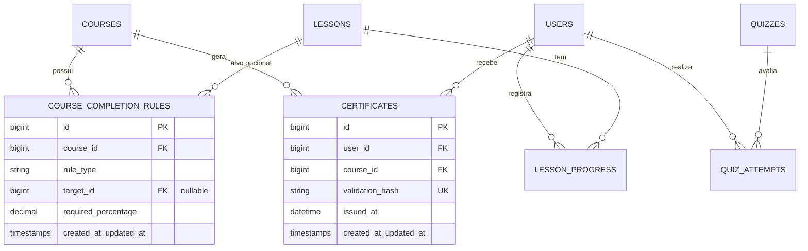

# Especificação Técnica 06: Certificados e Validação Pública

## 1. Visão Geral e Objetivos do Módulo

O módulo de **Certificados e Validação Pública** da Plataforma EAD é responsável pela gestão automatizada de elegibilidade, emissão de documentos oficiais em PDF e verificação pública de autenticidade, atendendo aos requisitos de baixo custo operacional e garantia de integridade institucional.

Em um contexto de qualificação técnica para eletricistas associados, a emissão do certificado representa a coroação do processo pedagógico. Para evitar fraudes ou emissões indevidas sem qualquer infraestrutura paga de terceiros, o sistema utiliza um **Motor de Elegibilidade dinâmico** baseado em regras parametrizadas por curso, um **Gerador de PDF de alta fidelidade visual** e um **Algoritmo de Hashing Criptográfico Imutável (SHA-256)** que vincula o certificado à chave secreta da aplicação (`APP_KEY`).

### Mapeamento de Requisitos e Casos de Uso
- **Requisitos Funcionais (RF):**
  - **RF10 (Regras de Certificado):** Permitir ao Admin configurar pré-requisitos customizados por curso (% de aulas concluídas, nota mínima em questionários, lições específicas).
  - **RF16 (Emissão de Certificado):** Gerar o arquivo PDF do certificado quando todas as regras do curso forem cumpridas.
  - **RF17 (Validação de Certificado):** Consultar autenticidade pública do certificado via código Hash SHA-256 ou leitura de QR Code.
- **Regras de Negócio (RN):**
  - **RN01 (Liberação do Certificado):** O certificado só é liberado para geração se 100% das regras associadas ao curso estiverem satisfeitas.
  - **RN07 (Imutabilidade do Certificado):** O código hash de validação é determinado univocamente por `sha256(user_id + course_id + formatted_issued_at + APP_KEY)`.
- **Casos de Uso (UC):**
  - **UC09 (Emissão e Download do Certificado):** Aluno ou Admin visualiza/baixa o PDF do certificado após aprovação.
  - **UC10 (Validação Pública de Certificados):** Visitante ou conselho verifica a validade do certificado na rota pública.
  - **UC15 (Configuração de Pré-requisitos para Emissão):** Admin define as regras de conclusão do curso.

### Chaves de Ajuda Contextual (Help Keys)
- `admin.rules.edit`: Exibida no painel administrativo `/admin/cursos/{course}/regras`, orientando a criação de regras de conclusão.
- `student.certificate.view`: Exibida na área do aluno `/aluno/cursos/{course}/certificado`, explicando os critérios para desbloqueio e o processo de emissão.
- `public.certificate.verify`: Exibida na página pública `/validar-certificado`, orientando sobre como localizar o Hash SHA-256 no certificado físico/digital ou escanear o QR Code.

---

## 2. Modelo de Dados e Migrações

### 2.1. Diagrama de Relacionamentos (ERD)



### 2.2. Dicionário de Dados

#### Tabela: `course_completion_rules`
Armazena as regras de pré-requisitos configuradas pelo Administrador para cada curso.
| Coluna | Tipo | Nulo | Padrão | Descrição |
| :--- | :--- | :--- | :--- | :--- |
| `id` | `BigInt` (Unsigned, Auto) | Não | - | Chave primária. |
| `course_id` | `BigInt` (Unsigned) | Não | - | Foreign Key -> `courses.id` (ON DELETE CASCADE). |
| `rule_type` | `Enum('content_percentage', 'quiz_score', 'specific_lesson')` | Não | - | Tipo da regra de conclusão. |
| `target_id` | `BigInt` (Unsigned) | Sim | NULL | ID do recurso alvo (ex: `lesson_id` se `rule_type` == 'specific_lesson' ou `quiz_id` se 'quiz_score'). |
| `required_percentage` | `Decimal(5,2)` | Não | 100.00 | Porcentagem exigida para cumprimento da regra (ex: 80.00 para 80% dos vídeos ou 70.00 de nota no quiz). |
| `created_at` | `Timestamp` | Sim | NULL | Data de criação. |
| `updated_at` | `Timestamp` | Sim | NULL | Data de atualização. |

#### Tabela: `certificates`
Armazena o registro de certificados emitidos de forma imutável.
| Coluna | Tipo | Nulo | Padrão | Descrição |
| :--- | :--- | :--- | :--- | :--- |
| `id` | `BigInt` (Unsigned, Auto) | Não | - | Chave primária. |
| `user_id` | `BigInt` (Unsigned) | Não | - | Foreign Key -> `users.id` (ON DELETE RESTRICT). |
| `course_id` | `BigInt` (Unsigned) | Não | - | Foreign Key -> `courses.id` (ON DELETE RESTRICT). |
| `validation_hash` | `Char(64)` | Não | - | Hash SHA-256 único de validação imutável. Unique Key. |
| `issued_at` | `DateTime` | Não | - | Data e hora exatas da emissão inicial. |
| `created_at` | `Timestamp` | Sim | NULL | Timestamp do registro. |
| `updated_at` | `Timestamp` | Sim | NULL | Timestamp do registro. |

*Chave Única Composta:* `UNIQUE KEY certificates_user_course_unique (user_id, course_id)`

---

### 2.3. Migrações Laravel (Code Snippets)

#### File: `database/migrations/2026_01_01_000012_create_course_completion_rules_table.php`
```php
<?php

use Illuminate\Database\Migrations\Migration;
use Illuminate\Database\Schema\Blueprint;
use Illuminate\Support\Facades\Schema;

return new class extends Migration
{
    public function up(): void
    {
        Schema::create('course_completion_rules', function (Blueprint $table) {
            $table->id();
            $table->foreignId('course_id')->constrained('courses')->cascadeOnDelete();
            $table->enum('rule_type', ['content_percentage', 'quiz_score', 'specific_lesson']);
            $table->unsignedBigInteger('target_id')->nullable();
            $table->decimal('required_percentage', 5, 2)->default(100.00);
            $table->timestamps();

            $table->index(['course_id', 'rule_type']);
        });
    }

    public function down(): void
    {
        Schema::dropIfExists('course_completion_rules');
    }
};
```

#### File: `database/migrations/2026_01_01_000016_create_certificates_table.php`
```php
<?php

use Illuminate\Database\Migrations\Migration;
use Illuminate\Database\Schema\Blueprint;
use Illuminate\Support\Facades\Schema;

return new class extends Migration
{
    public function up(): void
    {
        Schema::create('certificates', function (Blueprint $table) {
            $table->id();
            $table->foreignId('user_id')->constrained('users')->restrictOnDelete();
            $table->foreignId('course_id')->constrained('courses')->restrictOnDelete();
            $table->char('validation_hash', 64)->unique();
            $table->dateTime('issued_at');
            $table->timestamps();

            $table->unique(['user_id', 'course_id']);
        });
    }

    public function down(): void
    {
        Schema::dropIfExists('certificates');
    }
};
```

---

### 2.4. Enums e Eloquent Models

#### File: `app/Enums/RuleTypeEnum.php`
```php
<?php

namespace App\Enums;

enum RuleTypeEnum: string
{
    case CONTENT_PERCENTAGE = 'content_percentage';
    case QUIZ_SCORE = 'quiz_score';
    case SPECIFIC_LESSON = 'specific_lesson';

    public function label(): string
    {
        return match ($this) {
            self::CONTENT_PERCENTAGE => 'Porcentagem de Conteúdo Consumido',
            self::QUIZ_SCORE => 'Nota Mínima em Questionário',
            self::SPECIFIC_LESSON => 'Conclusão de Lição Específica',
        };
    }
}
```

#### File: `app/Models/CourseCompletionRule.php`
```php
<?php

namespace App\Models;

use App\Enums\RuleTypeEnum;
use Illuminate\Database\Eloquent\Factories\HasFactory;
use Illuminate\Database\Eloquent\Model;
use Illuminate\Database\Eloquent\Relations\BelongsTo;

class CourseCompletionRule extends Model
{
    use HasFactory;

    protected $fillable = [
        'course_id',
        'rule_type',
        'target_id',
        'required_percentage',
    ];

    protected $casts = [
        'rule_type' => RuleTypeEnum::class,
        'required_percentage' => 'float',
    ];

    public function course(): BelongsTo
    {
        return $this->belongsTo(Course::class);
    }
}
```

#### File: `app/Models/Certificate.php`
```php
<?php

namespace App\Models;

use Illuminate\Database\Eloquent\Factories\HasFactory;
use Illuminate\Database\Eloquent\Model;
use Illuminate\Database\Eloquent\Relations\BelongsTo;

class Certificate extends Model
{
    use HasFactory;

    protected $fillable = [
        'user_id',
        'course_id',
        'validation_hash',
        'issued_at',
    ];

    protected $casts = [
        'issued_at' => 'datetime',
    ];

    public function user(): BelongsTo
    {
        return $this->belongsTo(User::class);
    }

    public function course(): BelongsTo
    {
        return $this->belongsTo(Course::class);
    }
}
```

---

## 3. Motor de Elegibilidade de Certificado (`CertificateEligibilityService`)

O `CertificateEligibilityService` avalia se um aluno atendeu a 100% dos pré-requisitos configurados para um determinado curso. Se um curso **não possuir nenhuma regra configurada**, adota-se por padrão a exigência de **100% de conclusão de todas as lições publicadas** do curso.

### 3.1. Lógica de Avaliação de Regras
1. **Regra `content_percentage`**:
   - `total_published_lessons` = Contagem de lições publicadas no curso.
   - `completed_lessons` = Contagem de lições do curso marcadas como concluídas em `lesson_progress` para o usuário.
   - `user_percentage` = `(completed_lessons / total_published_lessons) * 100`.
   - Válido se `user_percentage >= required_percentage`.
2. **Regra `quiz_score`**:
   - Se `target_id` for informado, avalia a maior pontuação (`score_percentage`) do usuário na tabela `quiz_attempts` para aquele `quiz_id` específico onde `is_passed = true`.
   - Se `target_id` for `null`, avalia se o usuário obteve a pontuação requerida em **todos os questionários** associados às lições do curso.
   - Válido se `max_score >= required_percentage`.
3. **Regra `specific_lesson`**:
   - Requer `target_id` apontando para uma `lesson_id`.
   - Válido se existir registro na tabela `lesson_progress` para `(user_id, target_id)` com `is_completed = true`.

### 3.2. Implementação da Classe `CertificateEligibilityService`

#### File: `app/Services/CertificateEligibilityService.php`
```php
<?php

namespace App\Services;

use App\Enums\RuleTypeEnum;
use App\Models\Course;
use App\Models\CourseCompletionRule;
use App\Models\Lesson;
use App\Models\LessonProgress;
use App\Models\QuizAttempt;
use App\Models\User;
use Illuminate\Support\Collection;

class CertificateEligibilityService
{
    /**
     * Avalia a elegibilidade geral do usuário para receber o certificado do curso.
     * Retorna array com status boolean e detalhes de cada regra.
     */
    public function evaluate(User $user, Course $course): array
    {
        $rules = $course->completionRules;

        // Se o curso não possui regras customizadas cadastradas, adota regra padrão: 100% das lições consumidas.
        if ($rules->isEmpty()) {
            return $this->evaluateDefaultRule($user, $course);
        }

        $results = [];
        $isEligible = true;

        foreach ($rules as $rule) {
            $ruleResult = match ($rule->rule_type) {
                RuleTypeEnum::CONTENT_PERCENTAGE => $this->checkContentPercentage($user, $course, $rule),
                RuleTypeEnum::QUIZ_SCORE => $this->checkQuizScore($user, $course, $rule),
                RuleTypeEnum::SPECIFIC_LESSON => $this->checkSpecificLesson($user, $rule),
            };

            $results[] = $ruleResult;

            if (! $ruleResult['passed']) {
                $isEligible = false;
            }
        }

        return [
            'eligible' => $isEligible,
            'rules' => $results,
        ];
    }

    private function evaluateDefaultRule(User $user, Course $course): array
    {
        $totalLessons = Lesson::whereHas('module', fn ($q) => $q->where('course_id', $course->id))
            ->where('is_published', true)
            ->count();

        if ($totalLessons === 0) {
            return [
                'eligible' => false,
                'rules' => [[
                    'type' => 'default',
                    'description' => 'O curso não possui lições publicadas.',
                    'passed' => false,
                    'current' => 0,
                    'required' => 100,
                ]],
            ];
        }

        $completedLessons = LessonProgress::where('user_id', $user->id)
            ->where('is_completed', true)
            ->whereHas('lesson.module', fn ($q) => $q->where('course_id', $course->id))
            ->count();

        $percentage = round(($completedLessons / $totalLessons) * 100, 2);
        $passed = $percentage >= 100.00;

        return [
            'eligible' => $passed,
            'rules' => [[
                'type' => 'default',
                'description' => 'Conclusão de 100% do conteúdo do curso (Padrão)',
                'passed' => $passed,
                'current' => $percentage,
                'required' => 100.00,
            ]],
        ];
    }

    private function checkContentPercentage(User $user, Course $course, CourseCompletionRule $rule): array
    {
        $totalLessons = Lesson::whereHas('module', fn ($q) => $q->where('course_id', $course->id))
            ->where('is_published', true)
            ->count();

        if ($totalLessons === 0) {
            return [
                'type' => $rule->rule_type->value,
                'description' => 'Porcentagem de conteúdo consumido',
                'passed' => false,
                'current' => 0,
                'required' => $rule->required_percentage,
            ];
        }

        $completedLessons = LessonProgress::where('user_id', $user->id)
            ->where('is_completed', true)
            ->whereHas('lesson.module', fn ($q) => $q->where('course_id', $course->id))
            ->count();

        $userPercentage = round(($completedLessons / $totalLessons) * 100, 2);
        $passed = $userPercentage >= $rule->required_percentage;

        return [
            'type' => $rule->rule_type->value,
            'description' => sprintf('Assistir a no mínimo %.0f%% do conteúdo do curso', $rule->required_percentage),
            'passed' => $passed,
            'current' => $userPercentage,
            'required' => $rule->required_percentage,
        ];
    }

    private function checkQuizScore(User $user, Course $course, CourseCompletionRule $rule): array
    {
        if ($rule->target_id) {
            $maxScore = QuizAttempt::where('user_id', $user->id)
                ->where('quiz_id', $rule->target_id)
                ->max('score_percentage') ?? 0.00;

            $passed = $maxScore >= $rule->required_percentage;

            return [
                'type' => $rule->rule_type->value,
                'description' => sprintf('Obter nota mínima de %.0f%% no questionário específico', $rule->required_percentage),
                'passed' => $passed,
                'current' => (float) $maxScore,
                'required' => $rule->required_percentage,
            ];
        }

        // Se target_id é nulo, avalia todos os quizzes do curso
        $quizIds = Course::find($course->id)
            ->modules()
            ->with('lessons.quiz')
            ->get()
            ->pluck('lessons')
            ->flatten()
            ->pluck('quiz')
            ->filter()
            ->pluck('id');

        if ($quizIds->isEmpty()) {
            return [
                'type' => $rule->rule_type->value,
                'description' => 'Avaliação dos questionários do curso',
                'passed' => true,
                'current' => 100.00,
                'required' => $rule->required_percentage,
            ];
        }

        $allPassed = true;
        $lowestScore = 100.00;

        foreach ($quizIds as $quizId) {
            $score = QuizAttempt::where('user_id', $user->id)
                ->where('quiz_id', $quizId)
                ->max('score_percentage') ?? 0.00;

            if ($score < $lowestScore) {
                $lowestScore = $score;
            }

            if ($score < $rule->required_percentage) {
                $allPassed = false;
            }
        }

        return [
            'type' => $rule->rule_type->value,
            'description' => sprintf('Obter nota mínima de %.0f%% em todos os questionários do curso', $rule->required_percentage),
            'passed' => $allPassed,
            'current' => (float) $lowestScore,
            'required' => $rule->required_percentage,
        ];
    }

    private function checkSpecificLesson(User $user, CourseCompletionRule $rule): array
    {
        $completed = LessonProgress::where('user_id', $user->id)
            ->where('lesson_id', $rule->target_id)
            ->where('is_completed', true)
            ->exists();

        $lesson = Lesson::find($rule->target_id);
        $title = $lesson ? $lesson->title : 'Lição obrigatória';

        return [
            'type' => $rule->rule_type->value,
            'description' => sprintf('Concluir a lição obrigatória: "%s"', $title),
            'passed' => $completed,
            'current' => $completed ? 100 : 0,
            'required' => 100,
        ];
    }
}
```

---

## 4. Configuração de Pré-requisitos pelo Admin

### 4.1. Controller Administrativo

#### File: `app/Http/Controllers/Admin/CourseCompletionRuleController.php`
```php
<?php

namespace App\Http/Controllers/Admin;

use App\Http/Controllers/Controller;
use App\Http/Requests/Admin/StoreCourseCompletionRuleRequest;
use App\Models\Course;
use App\Models\CourseCompletionRule;
use Illuminate\Http\RedirectResponse;
use Illuminate\View\View;

class CourseCompletionRuleController extends Controller
{
    public function edit(Course $course): View
    {
        $course->load(['completionRules', 'modules.lessons']);

        return view('admin.courses.rules', [
            'course' => $course,
            'helpKey' => 'admin.rules.edit',
        ]);
    }

    public function store(StoreCourseCompletionRuleRequest $request, Course $course): RedirectResponse
    {
        $course->completionRules()->create($request->validated());

        return redirect()
            ->route('admin.courses.rules.edit', $course)
            ->with('success', 'Regra de conclusão adicionada com sucesso.');
    }

    public function destroy(Course $course, CourseCompletionRule $rule): RedirectResponse
    {
        if ($rule->course_id !== $course->id) {
            abort(403);
        }

        $rule->delete();

        return redirect()
            ->route('admin.courses.rules.edit', $course)
            ->with('success', 'Regra removida com sucesso.');
    }
}
```

#### File: `app/Http/Requests/Admin/StoreCourseCompletionRuleRequest.php`
```php
<?php

namespace App\Http/Requests/Admin;

use App\Enums\RuleTypeEnum;
use Illuminate\Foundation\Http\FormRequest;
use Illuminate\Validation\Rule;

class StoreCourseCompletionRuleRequest extends FormRequest
{
    public function authorize(): bool
    {
        return $this->user()?->role === 'admin';
    }

    public function rules(): array
    {
        return [
            'rule_type' => ['required', Rule::enum(RuleTypeEnum::class)],
            'target_id' => ['nullable', 'integer'],
            'required_percentage' => ['required', 'numeric', 'min:1', 'max:100'],
        ];
    }
}
```

---

## 5. Algoritmo de Hashing Criptográfico e Motor de PDF

### 5.1. Algoritmo de Hash SHA-256 Imutável (RN07)

O hash de validação garante que um certificado não possa ser forjado nem adulterado. Ele é computado no momento da primeira emissão e gravado permanentemente na coluna `certificates.validation_hash`.

**Fórmula de Geração:**
```php
$issuedAtString = $issuedAt->format('Y-m-d H:i:s');
$appKey = config('app.key');
$rawString = sprintf('%d|%d|%s|%s', $userId, $courseId, $issuedAtString, $appKey);
$hash = hash('sha256', $rawString);
```

### 5.2. Action Class: `GenerateCertificatePdfAction`

#### File: `app/Actions/GenerateCertificatePdfAction.php`
```php
<?php

namespace App\Actions;

use App\Models\Certificate;
use App\Models\Course;
use App\Models\SystemSetting;
use App\Models\User;
use App\Services\CertificateEligibilityService;
use Barryvdh\DomPDF\Facade\Pdf;
use Illuminate\Support\Carbon;
use SimpleSoftwareIO\QrCode\Facades\QrCode;

class GenerateCertificatePdfAction
{
    public function __construct(
        private CertificateEligibilityService $eligibilityService
    ) {}

    public function execute(User $user, Course $course)
    {
        // 1. Valida elegibilidade
        $evaluation = $this->eligibilityService->evaluate($user, $course);
        if (! $evaluation['eligible']) {
            throw new \DomainException('O aluno ainda não atendeu a todos os pré-requisitos para este certificado.');
        }

        // 2. Busca ou cria o registro imutável do certificado
        $certificate = Certificate::firstOrCreate(
            ['user_id' => $user->id, 'course_id' => $course->id],
            [
                'issued_at' => Carbon::now(),
                'validation_hash' => $this->generateHash($user->id, $course->id, Carbon::now()),
            ]
        );

        // 3. Obtém dados de configuração (Logos, Assinaturas)
        $adminSignatureUrl = SystemSetting::get('admin_signature_path');
        $verificationUrl = route('public.certificates.show', ['hash' => $certificate->validation_hash]);

        // 4. Gera QR Code em Base64 PNG/SVG para embutir no HTML
        $qrCodeBase64 = 'data:image/svg+xml;base64,' . base64_encode(
            QrCode::format('svg')->size(120)->margin(1)->generate($verificationUrl)
        );

        // 5. Renderiza a View Blade para PDF
        $pdf = Pdf::loadView('certificates.pdf', [
            'certificate' => $certificate,
            'user' => $user,
            'course' => $course,
            'issuedAt' => $certificate->issued_at->format('d/m/Y'),
            'verificationUrl' => $verificationUrl,
            'qrCodeBase64' => $qrCodeBase64,
            'signatureUrl' => $adminSignatureUrl,
        ])->setPaper('a4', 'landscape');

        return $pdf;
    }

    private function generateHash(int $userId, int $courseId, Carbon $issuedAt): string
    {
        $formatted = $issuedAt->format('Y-m-d H:i:s');
        $secret = config('app.key');
        return hash('sha256', "{$userId}|{$courseId}|{$formatted}|{$secret}");
    }
}
```

### 5.3. Template Blade do Certificado PDF

#### File: `resources/views/certificates/pdf.blade.php`
```html
<!DOCTYPE html>
<html lang="pt-BR">
<head>
    <meta charset="UTF-8">
    <title>Certificado de Conclusão - {{ $course->title }}</title>
    <style>
        @page {
            margin: 0;
            size: a4 landscape;
        }
        body {
            font-family: 'Helvetica', 'Arial', sans-serif;
            margin: 0;
            padding: 40px;
            background-color: #ffffff;
            color: #1E293B;
        }
        .border-container {
            border: 10px solid #004080;
            padding: 30px;
            height: 90%;
            position: relative;
            box-sizing: border-box;
        }
        .header {
            text-align: center;
            margin-bottom: 20px;
        }
        .header h1 {
            color: #004080;
            font-size: 36px;
            text-transform: uppercase;
            letter-spacing: 2px;
            margin: 0;
        }
        .header p {
            font-size: 16px;
            color: #64748B;
            margin-top: 5px;
        }
        .content {
            text-align: center;
            margin-top: 40px;
        }
        .student-name {
            font-size: 30px;
            font-weight: bold;
            color: #004080;
            border-bottom: 2px solid #F7D700;
            display: inline-block;
            padding-bottom: 5px;
            margin: 15px 0;
        }
        .course-title {
            font-size: 24px;
            font-weight: bold;
            color: #1E293B;
        }
        .footer {
            position: absolute;
            bottom: 30px;
            left: 30px;
            right: 30px;
            display: table;
            width: 100%;
        }
        .footer-col {
            display: table-cell;
            vertical-align: bottom;
        }
        .qr-code {
            width: 100px;
        }
        .hash-code {
            font-family: monospace;
            font-size: 10px;
            color: #64748B;
            word-break: break-all;
        }
        .signature-box {
            text-align: center;
        }
        .signature-img {
            max-height: 50px;
        }
    </style>
</head>
<body>
    <div class="border-container">
        <div class="header">
            <h1>Certificado de Conclusão</h1>
            <p>Conselho de Eletricistas - Capacitação Continuada</p>
        </div>

        <div class="content">
            <p>Certificamos que</p>
            <div class="student-name">{{ $user->name }}</div>
            <p>CPF: {{ $user->cpf ?? 'Não Informado' }}</p>
            <p>concluiu com êxito o curso de capacitação profissional em</p>
            <div class="course-title">{{ $course->title }}</div>
            <p>com carga horária total de <strong>{{ $course->workload_hours }} horas</strong>, emitido em {{ $issuedAt }}.</p>
        </div>

        <div class="footer">
            <div class="footer-col" style="width: 30%;">
                
            </div>
            <div class="footer-col signature-box" style="width: 40%;">
                @if($signatureUrl)
                    <br>
                @endif
                <strong>Diretoria de Capacitação</strong><br>
                <small>Conselho Regional de Eletricistas</small>
            </div>
            <div class="footer-col" style="width: 30%; text-align: right;">
                <p style="margin: 0; font-size: 11px;">Código de Autenticidade:</p>
                <div class="hash-code">{{ $certificate->validation_hash }}</div>
                <p style="margin: 0; font-size: 9px; color: #94A3B8;">Valide em: {{ route('public.certificates.index') }}</p>
            </div>
        </div>
    </div>
</body>
</html>
```

---

## 6. Consulta Pública de Autenticidade

Qualquer cidadão ou instituição pode validar a autenticidade do certificado sem necessidade de login. A validação pode ocorrer informando o código hash manualmente na página pública `/validar-certificado` ou escaneando o QR Code gravado no documento que redireciona para `/validar-certificado/{hash}`.

### 6.1. Controller Público

#### File: `app/Http/Controllers/Public/CertificateVerificationController.php`
```php
<?php

namespace App\Http/Controllers/Public;

use App\Http/Controllers/Controller;
use App\Models\Certificate;
use Illuminate\Http\Request;
use Illuminate\View\View;

class CertificateVerificationController extends Controller
{
    public function index(): View
    {
        return view('public.certificates.verify', [
            'certificate' => null,
            'searched' => false,
            'helpKey' => 'public.certificate.verify',
        ]);
    }

    public function show(string $hash): View
    {
        $certificate = Certificate::with(['user', 'course'])
            ->where('validation_hash', trim($hash))
            ->first();

        return view('public.certificates.verify', [
            'certificate' => $certificate,
            'searched' => true,
            'hashInput' => $hash,
            'helpKey' => 'public.certificate.verify',
        ]);
    }

    public function search(Request $request): View
    {
        $request->validate([
            'hash' => ['required', 'string', 'size:64'],
        ]);

        return $this->show($request->input('hash'));
    }
}
```

### 6.2. Visualização Blade Pública (`verify.blade.php`)

#### File: `resources/views/public/certificates/verify.blade.php`
```html
@extends('layouts.public')

@section('title', 'Validação de Autenticidade de Certificado')

@section('content')
<div class="container py-5">
    <div class="row justify-content-center">
        <div class="col-md-8">
            <div class="card shadow-sm border-0">
                <div class="card-header bg-primary text-white p-4">
                    <h3 class="mb-0"><i class="bi bi-shield-check"></i> Autenticidade de Certificado</h3>
                    <p class="mb-0 text-white-50">Conselho Regional de Eletricistas</p>
                </div>

                <div class="card-body p-4">
                    <form action="{{ route('public.certificates.search') }}" method="POST" class="mb-4">
                        @csrf
                        <label for="hash" class="form-label font-weight-bold">Informe o Código Hash (SHA-256):</label>
                        <div class="input-group">
                            <input type="text" id="hash" name="hash" class="form-control form-control-lg font-monospace @error('hash') is-invalid @enderror" placeholder="Ex: 4a8f9b..." value="{{ $hashInput ?? old('hash') }}" maxlength="64" required>
                            <button type="submit" class="btn btn-primary btn-lg"><i class="bi bi-search"></i> Verificar</button>
                        </div>
                        @error('hash')
                            <div class="invalid-feedback d-block">{{ $message }}</div>
                        @enderror
                    </form>

                    @if($searched)
                        <hr>
                        @if($certificate)
                            <div class="alert alert-success d-flex align-items-center p-3" role="alert">
                                <i class="bi bi-check-circle-fill text-success fs-1 me-3"></i>
                                <div>
                                    <h4 class="alert-heading mb-1">CERTIFICADO VÁLIDO E AUTÊNTICO</h4>
                                    <p class="mb-0">Este certificado foi emitido oficialmente pela plataforma EAD.</p>
                                </div>
                            </div>

                            <table class="table table-bordered mt-3">
                                <tbody>
                                    <tr>
                                        <th class="bg-light" style="width: 30%;">Aluno / Portador:</th>
                                        <td>{{ $certificate->user->name }}</td>
                                    </tr>
                                    <tr>
                                        <th class="bg-light">Curso Concluído:</th>
                                        <td><strong>{{ $certificate->course->title }}</strong></td>
                                    </tr>
                                    <tr>
                                        <th class="bg-light">Carga Horária:</th>
                                        <td>{{ $certificate->course->workload_hours }} Horas</td>
                                    </tr>
                                    <tr>
                                        <th class="bg-light">Data de Emissão:</th>
                                        <td>{{ $certificate->issued_at->format('d/m/Y \à\s H:i:s') }}</td>
                                    </tr>
                                    <tr>
                                        <th class="bg-light">Hash de Registro:</th>
                                        <td class="font-monospace small text-break">{{ $certificate->validation_hash }}</td>
                                    </tr>
                                </tbody>
                            </table>
                        @else
                            <div class="alert alert-danger d-flex align-items-center p-3" role="alert">
                                <i class="bi bi-x-octagon-fill text-danger fs-1 me-3"></i>
                                <div>
                                    <h4 class="alert-heading mb-1">CERTIFICADO NÃO ENCONTRADO OU INVÁLIDO</h4>
                                    <p class="mb-0">O código fornecido não corresponde a nenhum certificado registrado no sistema.</p>
                                </div>
                            </div>
                        @endif
                    @endif
                </div>
                <div class="card-footer bg-light text-muted d-flex justify-content-between align-items-center">
                    <small><i class="bi bi-info-circle"></i> Central de Ajuda: <code>{{ $helpKey }}</code></small>
                    <a href="{{ route('help.show', ['key' => $helpKey]) }}" class="btn btn-sm btn-outline-secondary">Ajuda de Validação</a>
                </div>
            </div>
        </div>
    </div>
</div>
@endsection
```

---

## 7. Estratégia de Testes Automatizados (95%+ Cobertura)

### 7.1. Teste Unitário: `CertificateEligibilityServiceTest`

#### File: `tests/Unit/Services/CertificateEligibilityServiceTest.php`
```php
<?php

namespace Tests\Unit\Services;

use App\Enums\RuleTypeEnum;
use App\Models\Course;
use App\Models\CourseCompletionRule;
use App\Models\Lesson;
use App\Models\LessonProgress;
use App\Models\Module;
use App\Models\Quiz;
use App\Models\QuizAttempt;
use App\Models\User;
use App\Services\CertificateEligibilityService;
use Illuminate\Foundation\Testing\RefreshDatabase;
use Tests\TestCase;

class CertificateEligibilityServiceTest extends TestCase
{
    use RefreshDatabase;

    private CertificateEligibilityService $service;

    protected function setUp(): void
    {
        parent::setUp();
        $this->service = new CertificateEligibilityService();
    }

    public function test_user_is_not_eligible_if_no_lessons_completed_with_default_rule(): void
    {
        $user = User::factory()->create();
        $course = Course::factory()->create();
        $module = Module::factory()->create(['course_id' => $course->id]);
        Lesson::factory()->create(['module_id' => $module->id, 'is_published' => true]);

        $result = $this->service->evaluate($user, $course);

        $this->assertFalse($result['eligible']);
    }

    public function test_user_is_eligible_when_all_lessons_completed_with_default_rule(): void
    {
        $user = User::factory()->create();
        $course = Course::factory()->create();
        $module = Module::factory()->create(['course_id' => $course->id]);
        $lesson = Lesson::factory()->create(['module_id' => $module->id, 'is_published' => true]);

        LessonProgress::create([
            'user_id' => $user->id,
            'lesson_id' => $lesson->id,
            'is_completed' => true,
            'completed_at' => now(),
        ]);

        $result = $this->service->evaluate($user, $course);

        $this->assertTrue($result['eligible']);
    }

    public function test_custom_rule_quiz_score_fails_if_score_below_required(): void
    {
        $user = User::factory()->create();
        $course = Course::factory()->create();
        $module = Module::factory()->create(['course_id' => $course->id]);
        $lesson = Lesson::factory()->create(['module_id' => $module->id]);
        $quiz = Quiz::factory()->create(['lesson_id' => $lesson->id]);

        CourseCompletionRule::create([
            'course_id' => $course->id,
            'rule_type' => RuleTypeEnum::QUIZ_SCORE,
            'target_id' => $quiz->id,
            'required_percentage' => 80.00,
        ]);

        QuizAttempt::create([
            'user_id' => $user->id,
            'quiz_id' => $quiz->id,
            'score_percentage' => 75.00,
            'is_passed' => false,
            'completed_at' => now(),
        ]);

        $result = $this->service->evaluate($user, $course);

        $this->assertFalse($result['eligible']);
    }
}
```

### 7.2. Teste Feature/E2E: Public Verification (`PublicCertificateVerificationTest`)

#### File: `tests/Feature/PublicCertificateVerificationTest.php`
```php
<?php

namespace Tests\Feature;

use App\Models\Certificate;
use App\Models\Course;
use App\Models\User;
use Illuminate\Foundation\Testing\RefreshDatabase;
use Tests\TestCase;

class PublicCertificateVerificationTest extends TestCase
{
    use RefreshDatabase;

    public function test_can_verify_valid_certificate_by_hash(): void
    {
        $user = User::factory()->create(['name' => 'Carlos Silva']);
        $course = Course::factory()->create(['title' => 'NR-10 Segurança em Eletricidade']);
        $certificate = Certificate::create([
            'user_id' => $user->id,
            'course_id' => $course->id,
            'validation_hash' => hash('sha256', 'test-hash-key-12345'),
            'issued_at' => now(),
        ]);

        $response = $this->get(route('public.certificates.show', ['hash' => $certificate->validation_hash]));

        $response->assertStatus(200);
        $response->assertSee('CERTIFICADO VÁLIDO E AUTÊNTICO');
        $response->assertSee('Carlos Silva');
        $response->assertSee('NR-10 Segurança em Eletricidade');
    }

    public function test_shows_invalid_message_for_fake_hash(): void
    {
        $fakeHash = str_repeat('a', 64);

        $response = $this->get(route('public.certificates.show', ['hash' => $fakeHash]));

        $response->assertStatus(200);
        $response->assertSee('CERTIFICADO NÃO ENCONTRADO OU INVÁLIDO');
    }
}
```

---

## 8. Lista Detalhada de Tarefas de Desenvolvimento

- [ ] **1. Migrações e Modelos**
  - [ ] Criar migração e model `CourseCompletionRule` com enum de tipos de regra.
  - [ ] Criar migração e model `Certificate` com índice único composto `(user_id, course_id)` e hash SHA-256.
- [ ] **2. Backend & Motor de Elegibilidade**
  - [ ] Implementar `CertificateEligibilityService` cobrindo regras de conteúdo, nota em quiz e lição obrigatória.
  - [ ] Criar `GenerateCertificatePdfAction` integrado ao `barryvdh/laravel-dompdf` e gerador de QR Code.
  - [ ] Criar algoritmo de hash unívoco em `GenerateCertificatePdfAction` utilizando a `APP_KEY`.
- [ ] **3. Painel Administrativo**
  - [ ] Desenvolver `CourseCompletionRuleController` (edit, store, destroy).
  - [ ] Criar interface Blade `/admin/cursos/{course}/regras` com chaves de ajuda `admin.rules.edit`.
- [ ] **4. Área do Aluno & Emissão**
  - [ ] Adicionar botão de emissão/download do certificado na dashboard do aluno.
  - [ ] Integrar ajuda contextual `student.certificate.view`.
- [ ] **5. Consulta Pública**
  - [ ] Criar `CertificateVerificationController` e rotas `/validar-certificado` e `/validar-certificado/{hash}`.
  - [ ] Criar view Blade responsiva pública com status visual de autenticidade (Verde/Vermelho) e ajuda `public.certificate.verify`.
- [ ] **6. Suíte de Testes & Guardrails**
  - [ ] Escrever testes unitários para `CertificateEligibilityServiceTest`.
  - [ ] Escrever testes de integração para o gerador de PDF e formulário administrativo de regras.
  - [ ] Escrever testes E2E/Feature para a validação pública por Hash e QR Code.
  - [ ] Executar cobertura de código garantindo taxa de no mínimo **95%**.
