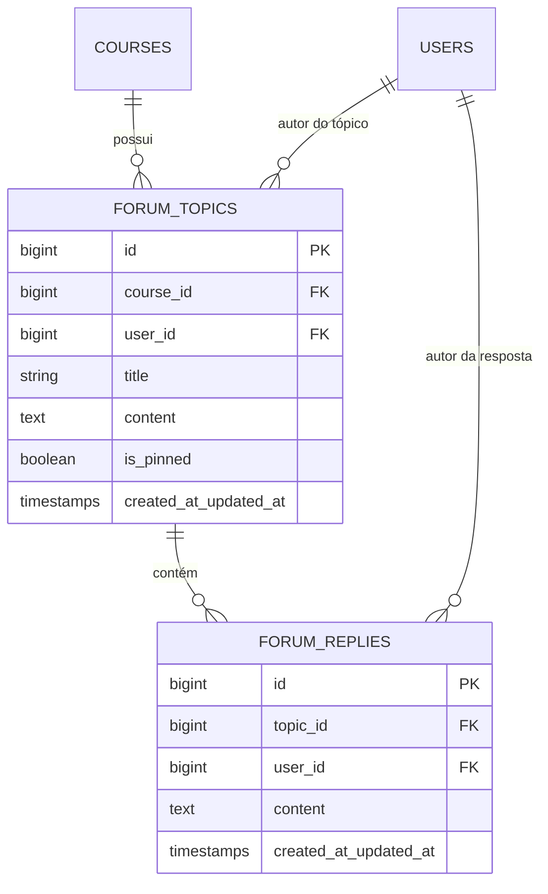

# Especificação Técnica 07: Fórum de Discussão do Curso

## 1. Visão Geral e Objetivos do Módulo

O módulo de **Fórum de Discussão do Curso** provê um espaço interativo, colaborativo e seguro por curso para que alunos matriculados e professores/administradores troquem dúvidas e conhecimentos. 

Operando sob as restrições de uma **hospedagem compartilhada** (sem serviços persistentes como WebSockets, Redis pub/sub ou daemons), o fórum utiliza atualização em tempo real baseada em **Polling AJAX otimizado via jQuery**, garantindo alta interatividade com consumo mínimo de recursos de servidor.

### Mapeamento de Requisitos e Casos de Uso
- **Requisitos Funcionais (RF):**
  - **RF22 (Fórum de Discussão do Curso):** Disponibilizar área interativa por curso para criação de tópicos de dúvida, troca de experiências e publicação de respostas.
- **Regras de Negócio (RN):**
  - **RN08 (Restrição Estrita de Matrícula):** Alunos sem registro ativo em `course_user` para o curso solicitado recebem HTTP 403 (Forbidden) ao tentar acessar o fórum.
  - **RN10 (Isolamento das Discussões do Fórum):** Apenas alunos matriculados e administradores podem ler, criar ou responder tópicos no fórum do curso correspondente.
- **Casos de Uso (UC):**
  - **UC17 (Fórum de Discussão do Curso):** Fluxos de listagem, criação de tópicos, publicação de respostas, fixação de tópicos pelo Admin e polling em tempo real.

### Chaves de Ajuda Contextual (Help Keys)
- `student.forum.index`: Exibida na listagem de tópicos do fórum `/aluno/cursos/{course}/forum`, orientando o aluno sobre como pesquisar dúvidas e criar novos tópicos.
- `student.forum.topic`: Exibida na tela do tópico `/aluno/cursos/{course}/forum/topicos/{topic}`, explicando a linha do tempo e a caixa de resposta rápida.

---

## 2. Modelo de Dados e Migrações

### 2.1. Diagrama de Relacionamentos (ERD)



### 2.2. Dicionário de Dados

#### Tabela: `forum_topics`
Armazena as discussões/dúvidas iniciadas pelos alunos ou administradores em um curso.
| Coluna | Tipo | Nulo | Padrão | Descrição |
| :--- | :--- | :--- | :--- | :--- |
| `id` | `BigInt` (Unsigned, Auto) | Não | - | Chave primária. |
| `course_id` | `BigInt` (Unsigned) | Não | - | Foreign Key -> `courses.id` (ON DELETE CASCADE). |
| `user_id` | `BigInt` (Unsigned) | Não | - | Foreign Key -> `users.id` (ON DELETE CASCADE). Autor do tópico. |
| `title` | `VarChar(200)` | Não | - | Título descritivo do tópico. |
| `content` | `Text` | Não | - | Conteúdo principal sanitizado do tópico. |
| `is_pinned` | `Boolean` | Não | false | Flag indicando se o tópico está fixado no topo pelo Admin. |
| `created_at` | `Timestamp` | Sim | NULL | Data e hora da criação. |
| `updated_at` | `Timestamp` | Sim | NULL | Data e hora da última atualização. |

#### Tabela: `forum_replies`
Armazena as respostas associadas a um tópico do fórum.
| Coluna | Tipo | Nulo | Padrão | Descrição |
| :--- | :--- | :--- | :--- | :--- |
| `id` | `BigInt` (Unsigned, Auto) | Não | - | Chave primária. |
| `topic_id` | `BigInt` (Unsigned) | Não | - | Foreign Key -> `forum_topics.id` (ON DELETE CASCADE). |
| `user_id` | `BigInt` (Unsigned) | Não | - | Foreign Key -> `users.id` (ON DELETE CASCADE). Autor da resposta. |
| `content` | `Text` | Não | - | Texto da resposta sanitizado contra XSS. |
| `created_at` | `Timestamp` | Sim | NULL | Data e hora da publicação. |
| `updated_at` | `Timestamp` | Sim | NULL | Data e hora da edição. |

---

### 2.3. Migrações Laravel

#### File: `database/migrations/2026_01_01_000014_create_forum_topics_table.php`
```php
<?php

use Illuminate\Database\Migrations\Migration;
use Illuminate\Database\Schema\Blueprint;
use Illuminate\Support\Facades\Schema;

return new class extends Migration
{
    public function up(): void
    {
        Schema::create('forum_topics', function (Blueprint $table) {
            $table->id();
            $table->foreignId('course_id')->constrained('courses')->cascadeOnDelete();
            $table->foreignId('user_id')->constrained('users')->cascadeOnDelete();
            $table->string('title', 200);
            $table->text('content');
            $table->boolean('is_pinned')->default(false);
            $table->timestamps();

            $table->index(['course_id', 'is_pinned', 'created_at']);
        });
    }

    public function down(): void
    {
        Schema::dropIfExists('forum_topics');
    }
};
```

#### File: `database/migrations/2026_01_01_000015_create_forum_replies_table.php`
```php
<?php

use Illuminate\Database\Migrations\Migration;
use Illuminate\Database\Schema\Blueprint;
use Illuminate\Support\Facades\Schema;

return new class extends Migration
{
    public function up(): void
    {
        Schema::create('forum_replies', function (Blueprint $table) {
            $table->id();
            $table->foreignId('topic_id')->constrained('forum_topics')->cascadeOnDelete();
            $table->foreignId('user_id')->constrained('users')->cascadeOnDelete();
            $table->text('content');
            $table->timestamps();

            $table->index(['topic_id', 'created_at']);
        });
    }

    public function down(): void
    {
        Schema::dropIfExists('forum_replies');
    }
};
```

---

### 2.4. Eloquent Models

#### File: `app/Models/ForumTopic.php`
```php
<?php

namespace App\Models;

use Illuminate\Database\Eloquent\Builder;
use Illuminate\Database\Eloquent\Factories\HasFactory;
use Illuminate\Database\Eloquent\Model;
use Illuminate\Database\Eloquent\Relations\BelongsTo;
use Illuminate\Database\Eloquent\Relations\HasMany;

class ForumTopic extends Model
{
    use HasFactory;

    protected $fillable = [
        'course_id',
        'user_id',
        'title',
        'content',
        'is_pinned',
    ];

    protected $casts = [
        'is_pinned' => 'boolean',
    ];

    public function course(): BelongsTo
    {
        return $this->belongsTo(Course::class);
    }

    public function user(): BelongsTo
    {
        return $this->belongsTo(User::class);
    }

    public function replies(): HasMany
    {
        return $this->hasMany(ForumReply::class, 'topic_id');
    }

    public function scopePinnedFirst(Builder $query): Builder
    {
        return $query->orderByDesc('is_pinned')->orderByDesc('updated_at');
    }
}
```

#### File: `app/Models/ForumReply.php`
```php
<?php

namespace App\Models;

use Illuminate\Database\Eloquent\Factories\HasFactory;
use Illuminate\Database\Eloquent\Model;
use Illuminate\Database\Eloquent\Relations\BelongsTo;

class ForumReply extends Model
{
    use HasFactory;

    protected $fillable = [
        'topic_id',
        'user_id',
        'content',
    ];

    public function topic(): BelongsTo
    {
        return $this->belongsTo(ForumTopic::class, 'topic_id');
    }

    public function user(): BelongsTo
    {
        return $this->belongsTo(User::class);
    }
}
```

---

## 3. Arquitetura de Segurança, Autorização e Sanitização XSS

### 3.1. Middleware: `EnsureStudentIsEnrolled`

O Middleware intercepta requisições para rotas do curso e valida se o usuário possui perfil `admin` ou possui matrícula ativa na tabela pivot `course_user`. Caso contrário, nega o acesso com status HTTP 403 Forbidden (RN08, RN10).

#### File: `app/Http/Middleware/EnsureStudentIsEnrolled.php`
```php
<?php

namespace App\Http\Middleware;

use Closure;
use Illuminate\Http\Request;
use Symfony\Component\HttpFoundation\Response;

class EnsureStudentIsEnrolled
{
    public function handle(Request $request, Closure $next): Response
    {
        $user = $request->user();
        if (! $user) {
            return redirect()->route('login');
        }

        // Administradores possuem acesso amplo e irrestrito
        if ($user->role === 'admin') {
            return $next($request);
        }

        // Recupera o objeto Course da rota (route parameter)
        $course = $request->route('course');
        $courseId = is_object($course) ? $course->id : (int) $course;

        if (! $courseId) {
            abort(404, 'Curso não encontrado.');
        }

        // Verifica vínculo ativo na tabela pivot course_user
        $isEnrolled = $user->courses()
            ->where('course_id', $courseId)
            ->wherePivot('status', 'active')
            ->exists();

        if (! $isEnrolled) {
            if ($request->expectsJson()) {
                return response()->json(['error' => 'Acesso negado. Matrícula ativa exigida.'], 403);
            }

            return redirect()
                ->route('student.courses.index')
                ->with('error', 'Acesso negado. Você não possui matrícula ativa neste curso.');
        }

        return $next($request);
    }
}
```

---

### 3.2. Authorization Policy: `ForumPolicy`

#### File: `app/Policies/ForumPolicy.php`
```php
<?php

namespace App\Policies;

use App\Models\Course;
use App\Models\ForumTopic;
use App\Models\User;

class ForumPolicy
{
    public function before(User $user, string $ability): ?bool
    {
        if ($user->role === 'admin') {
            return true;
        }

        return null;
    }

    public function viewAny(User $user, Course $course): bool
    {
        return $this->isEnrolled($user, $course);
    }

    public function view(User $user, ForumTopic $topic): bool
    {
        return $this->isEnrolled($user, $topic->course);
    }

    public function create(User $user, Course $course): bool
    {
        return $this->isEnrolled($user, $course);
    }

    public function reply(User $user, ForumTopic $topic): bool
    {
        return $this->isEnrolled($user, $topic->course);
    }

    public function pin(User $user, ForumTopic $topic): bool
    {
        return $user->role === 'admin';
    }

    private function isEnrolled(User $user, Course $course): bool
    {
        return $user->courses()
            ->where('course_id', $course->id)
            ->wherePivot('status', 'active')
            ->exists();
    }
}
```

---

### 3.3. Sanitizador XSS Rigoroso (`SanitizeForumInput`)

Para proteger o fórum contra XSS injection, todas as entradas de texto em tópicos e respostas passam por uma sanitização rigorosa via helper/service antes do salvamento no banco de dados.

#### File: `app/Services/SanitizeForumInput.php`
```php
<?php

namespace App\Services;

class SanitizeForumInput
{
    /**
     * Sanitiza strings removendo tags HTML perigosas e scripts.
     */
    public static function clean(?string $input): string
    {
        if (empty($input)) {
            return '';
        }

        // Permite apenas tags básicas de formatação segura (b, i, u, p, br, ul, ol, li, code, pre)
        $allowedTags = '<b><i><u><p><br><ul><ol><li><code><pre>';
        $stripped = strip_tags($input, $allowedTags);

        // Remove atributos de eventos Javascript (on* events) e URLs com javascript:
        $pattern = '/(on[a-z]+\s*=\s*[\'"][^\'"]*[\'"])|(javascript\s*:\s*)/i';
        
        return preg_replace($pattern, '', $stripped);
    }
}
```

---

## 4. Endpoints HTTP, Controllers e Form Requests

### 4.1. Mapeamento de Rotas (`routes/web.php`)

```php
use App\Http\Controllers\Admin\ForumPinController;
use App\Http\Controllers\Student\ForumReplyController;
use App\Http\Controllers\Student\ForumTopicController;
use App\Http\Middleware\EnsureStudentIsEnrolled;

Route::middleware(['auth', EnsureStudentIsEnrolled::class])->group(function () {
    // Listagem e criação de tópicos no fórum
    Route::get('/aluno/cursos/{course}/forum', [ForumTopicController::class, 'index'])
        ->name('student.forum.index');

    Route::post('/aluno/cursos/{course}/forum/topicos', [ForumTopicController::class, 'store'])
        ->name('student.forum.store');

    // Visualização do tópico e postagem de respostas
    Route::get('/aluno/cursos/{course}/forum/topicos/{topic}', [ForumTopicController::class, 'show'])
        ->name('student.forum.show');

    Route::post('/aluno/cursos/{course}/forum/topicos/{topic}/respostas', [ForumReplyController::class, 'store'])
        ->name('student.forum.reply');

    // Polling AJAX de respostas recentes
    Route::get('/aluno/cursos/{course}/forum/topicos/{topic}/poll-replies', [ForumReplyController::class, 'poll'])
        ->name('student.forum.poll');

    // Ação exclusiva Admin: Fixar/Desfixar Tópico
    Route::patch('/admin/cursos/{course}/forum/topicos/{topic}/pin', [ForumPinController::class, 'toggle'])
        ->middleware('can:pin,topic')
        ->name('admin.forum.pin');
});
```

---

### 4.2. Controllers e Requests Implementation

#### File: `app/Http/Requests/StoreForumTopicRequest.php`
```php
<?php

namespace App\Http\Requests;

use Illuminate\Foundation\Http\FormRequest;

class StoreForumTopicRequest extends FormRequest
{
    public function authorize(): bool
    {
        return true; // Autorização já gerenciada no middleware EnsureStudentIsEnrolled + Policy
    }

    public function rules(): array
    {
        return [
            'title' => ['required', 'string', 'max:200', 'min:5'],
            'content' => ['required', 'string', 'min:10', 'max:5000'],
        ];
    }
}
```

#### File: `app/Http/Controllers/Student/ForumTopicController.php`
```php
<?php

namespace App\Http\Controllers\Student;

use App\Http\Controllers\Controller;
use App\Http\Requests\StoreForumTopicRequest;
use App\Models\Course;
use App\Models\ForumTopic;
use App\Services\SanitizeForumInput;
use Illuminate\Http\RedirectResponse;
use Illuminate\View\View;

class ForumTopicController extends Controller
{
    public function index(Course $course): View
    {
        $topics = ForumTopic::where('course_id', $course->id)
            ->with(['user', 'replies'])
            ->withCount('replies')
            ->pinnedFirst()
            ->paginate(15);

        return view('student.forum.index', [
            'course' => $course,
            'topics' => $topics,
            'helpKey' => 'student.forum.index',
        ]);
    }

    public function store(StoreForumTopicRequest $request, Course $course): RedirectResponse
    {
        $topic = ForumTopic::create([
            'course_id' => $course->id,
            'user_id' => $request->user()->id,
            'title' => SanitizeForumInput::clean($request->input('title')),
            'content' => SanitizeForumInput::clean($request->input('content')),
            'is_pinned' => false,
        ]);

        return redirect()
            ->route('student.forum.show', ['course' => $course->id, 'topic' => $topic->id])
            ->with('success', 'Tópico publicado com sucesso.');
    }

    public function show(Course $course, ForumTopic $topic): View
    {
        if ($topic->course_id !== $course->id) {
            abort(404);
        }

        $topic->load(['user', 'replies.user']);

        return view('student.forum.show', [
            'course' => $course,
            'topic' => $topic,
            'helpKey' => 'student.forum.topic',
        ]);
    }
}
```

#### File: `app/Http/Controllers/Student/ForumReplyController.php`
```php
<?php

namespace App\Http\Controllers\Student;

use App\Http\Controllers\Controller;
use App\Models\Course;
use App\Models\ForumReply;
use App\Models\ForumTopic;
use App\Services\SanitizeForumInput;
use Illuminate\Http\JsonResponse;
use Illuminate\Http\Request;

class ForumReplyController extends Controller
{
    public function store(Request $request, Course $course, ForumTopic $topic): JsonResponse
    {
        $request->validate([
            'content' => ['required', 'string', 'min:2', 'max:3000'],
        ]);

        $reply = ForumReply::create([
            'topic_id' => $topic->id,
            'user_id' => $request->user()->id,
            'content' => SanitizeForumInput::clean($request->input('content')),
        ]);

        // Atualiza timestamp do tópico para subir na ordenação
        $topic->touch();

        $reply->load('user');

        return response()->json([
            'success' => true,
            'message' => 'Resposta enviada com sucesso!',
            'reply' => [
                'id' => $reply->id,
                'user_name' => $reply->user->name,
                'is_admin' => $reply->user->role === 'admin',
                'content' => $reply->content,
                'created_at' => $reply->created_at->format('d/m/Y \à\s H:i'),
            ],
        ], 201);
    }

    public function poll(Request $request, Course $course, ForumTopic $topic): JsonResponse
    {
        $lastReplyId = (int) $request->query('last_reply_id', 0);

        $newReplies = ForumReply::where('topic_id', $topic->id)
            ->where('id', '>', $lastReplyId)
            ->with('user')
            ->orderBy('id', 'asc')
            ->get();

        $formatted = $newReplies->map(fn ($r) => [
            'id' => $r->id,
            'user_name' => $r->user->name,
            'is_admin' => $r->user->role === 'admin',
            'content' => $r->content,
            'created_at' => $r->created_at->format('d/m/Y \à\s H:i'),
        ]);

        return response()->json([
            'replies' => $formatted,
        ]);
    }
}
```

#### File: `app/Http/Controllers/Admin/ForumPinController.php`
```php
<?php

namespace App\Http\Controllers\Admin;

use App\Http/Controllers/Controller;
use App\Models\Course;
use App\Models\ForumTopic;
use Illuminate\Http\RedirectResponse;

class ForumPinController extends Controller
{
    public function toggle(Course $course, ForumTopic $topic): RedirectResponse
    {
        if ($topic->course_id !== $course->id) {
            abort(404);
        }

        $topic->update([
            'is_pinned' => ! $topic->is_pinned,
        ]);

        $status = $topic->is_pinned ? 'fixado' : 'desfixado';

        return redirect()
            ->back()
            ->with('success', "Tópico {$status} com sucesso.");
    }
}
```

---

## 5. Polling em Tempo Real via jQuery AJAX

Sem suporte a WebSockets em hospedagem compartilhada, o cliente faz requisições AJAX periódicas enviando o ID da última resposta recebida (`last_reply_id`). O servidor retorna apenas as respostas superiores a esse ID, minimizando a transferência de dados e carga no servidor.

```javascript
// Exemplo de Script jQuery Polling incluído em show.blade.php
$(document).ready(function() {
    let lastReplyId = parseInt($('#timeline-replies').data('last-reply-id')) || 0;
    const pollUrl = $('#timeline-replies').data('poll-url');

    function fetchNewReplies() {
        $.ajax({
            url: pollUrl,
            type: 'GET',
            data: { last_reply_id: lastReplyId },
            dataType: 'json',
            success: function(response) {
                if (response.replies && response.replies.length > 0) {
                    response.replies.forEach(function(reply) {
                        renderReplyCard(reply);
                        lastReplyId = Math.max(lastReplyId, reply.id);
                    });
                    $('#timeline-replies').data('last-reply-id', lastReplyId);
                }
            }
        });
    }

    function renderReplyCard(reply) {
        const badge = reply.is_admin 
            ? '<span class="badge bg-danger ms-2">Professor / Admin</span>' 
            : '<span class="badge bg-secondary ms-2">Aluno</span>';

        const html = `
            <div class="card mb-3 border-0 shadow-sm reply-item" id="reply-${reply.id}">
                <div class="card-body">
                    <div class="d-flex justify-content-between align-items-center mb-2">
                        <strong>${escapeHtml(reply.user_name)} ${badge}</strong>
                        <small class="text-muted">${reply.created_at}</small>
                    </div>
                    <div class="reply-content">${reply.content}</div>
                </div>
            </div>`;
        
        $('#replies-container').append(html);
    }

    function escapeHtml(text) {
        return $('<div>').text(text).html();
    }

    // Executa polling a cada 10 segundos
    setInterval(fetchNewReplies, 10000);
});
```

---

## 6. Interface do Usuário (Views Blade)

### 6.1. Listagem do Fórum (`index.blade.php`)

#### File: `resources/views/student/forum/index.blade.php`
```html
@extends('layouts.app')

@section('title', 'Fórum de Discussão - ' . $course->title)

@section('content')
<div class="container py-4">
    <div class="d-flex justify-content-between align-items-center mb-4">
        <div>
            <h2 class="mb-1 text-primary"><i class="bi bi-chat-square-dots"></i> Fórum do Curso</h2>
            <p class="text-muted mb-0">{{ $course->title }}</p>
        </div>
        <button class="btn btn-primary" data-bs-toggle="modal" data-bs-target="#newTopicModal">
            <i class="bi bi-plus-lg"></i> Novo Tópico
        </button>
    </div>

    @if(session('success'))
        <div class="alert alert-success alert-dismissible fade show" role="alert">
            {{ session('success') }}
            <button type="button" class="btn-close" data-bs-dismiss="modal" aria-label="Close"></button>
        </div>
    @endif

    <div class="card shadow-sm border-0">
        <div class="card-body p-0">
            <div class="list-group list-group-flush">
                @forelse($topics as $topic)
                    <div class="list-group-item p-3 {{ $topic->is_pinned ? 'bg-light' : '' }}">
                        <div class="d-flex w-100 justify-content-between align-items-center">
                            <div>
                                @if($topic->is_pinned)
                                    <span class="badge bg-warning text-dark me-2"><i class="bi bi-pin-angle-fill"></i> Fixado</span>
                                @endif
                                <a href="{{ route('student.forum.show', ['course' => $course->id, 'topic' => $topic->id]) }}" class="h5 text-decoration-none text-dark">
                                    {{ $topic->title }}
                                </a>
                                <div class="mt-1 small text-muted">
                                    Por <strong>{{ $topic->user->name }}</strong>
                                    @if($topic->user->role === 'admin')
                                        <span class="badge bg-danger ms-1">Professor</span>
                                    @else
                                        <span class="badge bg-secondary ms-1">Aluno</span>
                                    @endif
                                    &bull; {{ $topic->created_at->diffForHumans() }}
                                </div>
                            </div>
                            <div class="text-end">
                                <span class="badge bg-info text-dark rounded-pill px-3 py-2">
                                    <i class="bi bi-chat-left-text"></i> {{ $topic->replies_count }} respostas
                                </span>
                                @if(auth()->user()->role === 'admin')
                                    <form action="{{ route('admin.forum.pin', ['course' => $course->id, 'topic' => $topic->id]) }}" method="POST" class="d-inline ms-2">
                                        @csrf
                                        @method('PATCH')
                                        <button type="submit" class="btn btn-sm btn-outline-warning" title="{{ $topic->is_pinned ? 'Desfixar' : 'Fixar' }}">
                                            <i class="bi bi-pin-angle"></i>
                                        </button>
                                    </form>
                                @endif
                            </div>
                        </div>
                    </div>
                @empty
                    <div class="p-5 text-center text-muted">
                        <i class="bi bi-chat-quote fs-1"></i>
                        <p class="mt-2 mb-0">Nenhum tópico aberto ainda. Seja o primeiro a perguntar!</p>
                    </div>
                @endforelse
            </div>
        </div>
        <div class="card-footer bg-white">
            {{ $topics->links() }}
        </div>
    </div>
</div>

<!-- Modal Novo Tópico -->
<div class="modal fade" id="newTopicModal" tabindex="-1" aria-hidden="true">
    <div class="modal-dialog modal-lg">
        <form action="{{ route('student.forum.store', ['course' => $course->id]) }}" method="POST">
            @csrf
            <div class="modal-content">
                <div class="modal-header">
                    <h5 class="modal-title">Novo Tópico de Discussão</h5>
                    <button type="button" class="btn-close" data-bs-dismiss="modal"></button>
                </div>
                <div class="modal-body">
                    <div class="mb-3">
                        <label for="title" class="form-label font-weight-bold">Título da Dúvida / Tópico</label>
                        <input type="text" name="title" id="title" class="form-control" placeholder="Ex: Dúvida sobre o dimensionamento do disjuntor" required>
                    </div>
                    <div class="mb-3">
                        <label for="content" class="form-label font-weight-bold">Descrição Detalhada</label>
                        <textarea name="content" id="content" rows="6" class="form-control" placeholder="Explique sua dúvida com detalhes..." required></textarea>
                    </div>
                </div>
                <div class="modal-footer">
                    <button type="button" class="btn btn-secondary" data-bs-dismiss="modal">Cancelar</button>
                    <button type="submit" class="btn btn-primary">Publicar Tópico</button>
                </div>
            </div>
        </form>
    </div>
</div>
@endsection
```

---

## 7. Estratégia de Testes Automatizados (95%+ Cobertura)

### 7.1. Teste de Integração: Matrícula & Autorização (`ForumAccessTest`)

#### File: `tests/Feature/ForumAccessTest.php`
```php
<?php

namespace Tests\Feature;

use App\Models\Course;
use App\Models\User;
use Illuminate\Foundation\Testing\RefreshDatabase;
use Tests\TestCase;

class ForumAccessTest extends TestCase
{
    use RefreshDatabase;

    public function test_non_enrolled_student_cannot_access_forum_and_receives_403(): void
    {
        $user = User::factory()->create(['role' => 'student']);
        $course = Course::factory()->create();

        $response = $this->actingAs($user)->get(route('student.forum.index', ['course' => $course->id]));

        $response->assertStatus(302);
        $response->assertRedirect(route('student.courses.index'));
        $response->assertSessionHas('error');
    }

    public function test_enrolled_student_can_access_forum(): void
    {
        $user = User::factory()->create(['role' => 'student']);
        $course = Course::factory()->create();

        // Realiza matrícula ativa
        $user->courses()->attach($course->id, ['enrolled_at' => now(), 'status' => 'active']);

        $response = $this->actingAs($user)->get(route('student.forum.index', ['course' => $course->id]));

        $response->assertStatus(200);
        $response->assertSee('Fórum do Curso');
    }

    public function test_admin_can_access_any_forum_without_enrollment(): void
    {
        $admin = User::factory()->create(['role' => 'admin']);
        $course = Course::factory()->create();

        $response = $this->actingAs($admin)->get(route('student.forum.index', ['course' => $course->id]));

        $response->assertStatus(200);
    }
}
```

---

## 8. Lista Passo a Passo de Tarefas de Desenvolvimento

- [ ] **1. Migrações e Modelos**
  - [ ] Criar migração e model `ForumTopic` com relacionamento cascade com `courses` e `users`.
  - [ ] Criar migração e model `ForumReply` com relacionamento com `forum_topics` e `users`.
- [ ] **2. Segurança & Middleware**
  - [ ] Implementar middleware `EnsureStudentIsEnrolled` para barrar não matriculados (HTTP 403 / Redirect).
  - [ ] Criar `ForumPolicy` com permissão estrita e regra especial de admin para fixar tópicos (`pin`).
  - [ ] Criar serviço de sanitização `SanitizeForumInput` contra ataques XSS.
- [ ] **3. Endpoints e Form Requests**
  - [ ] Registrar rotas do fórum protegidas pelo middleware de matrícula.
  - [ ] Criar `ForumTopicController` (index, store, show).
  - [ ] Criar `ForumReplyController` com método `store` (AJAX) e `poll` para atualização em tempo real.
  - [ ] Criar `Admin/ForumPinController` com funcionalidade de fixar/desfixar.
- [ ] **4. Frontend e jQuery Polling**
  - [ ] Criar visualização Blade `student.forum.index` com badges de perfil e modal de criação.
  - [ ] Criar visualização Blade `student.forum.show` com histórico de respostas e formulário AJAX.
  - [ ] Escrever script jQuery AJAX de polling periódico (10s) para sincronização automática de respostas sem WebSockets.
- [ ] **5. Suíte de Testes & Guardrails**
  - [ ] Escrever testes de autorização para o Middleware `EnsureStudentIsEnrolled` (cenários de erro 403, acesso admin e matriculado).
  - [ ] Escrever testes de integração para criação de tópico sanitizado contra XSS.
  - [ ] Escrever testes E2E/Feature para o fluxo de respostas e polling via AJAX.
  - [ ] Auditar cobertura de testes garantindo taxa de no mínimo **95%**.
