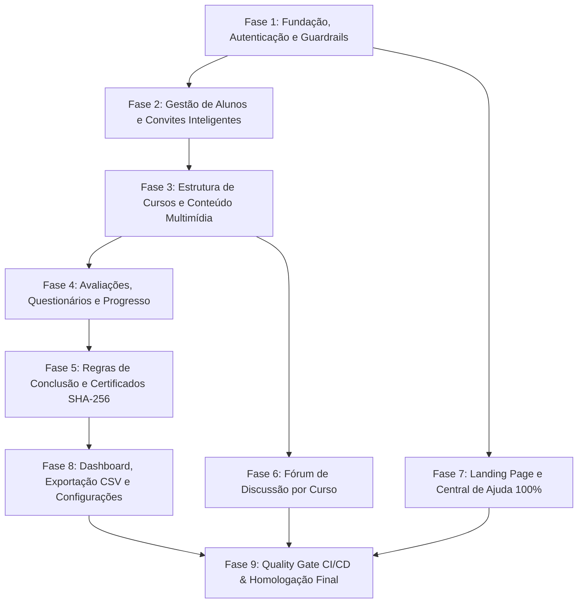

# **Índice Geral de Especificações Técnicas, Matriz de Rastreabilidade e Roadmap de Desenvolvimento**

---

## **1. Visão Geral do Projeto**

Esta pasta contém o conjunto completo e autossuficiente de **Especificações Técnicas de Implementação** para a **Plataforma EAD de Capacitação de Eletricistas**. O projeto atende a rigorosos critérios de arquitetura enxuta em Laravel, otimização de custos para hospedagem compartilhada e um **Guardrail Rígido de Qualidade de 95%+ de cobertura de testes**.

### **Estrutura do Repositório de Especificações (`spec/specs/`)**

1. **[`00-architecture-database-and-guardrails.md`](file:///home/rafael.paula/pessoal/cursos/laravel-app/spec/specs/00-architecture-database-and-guardrails.md)**: Arquitetura Geral MVC, esquema de banco de dados (18 tabelas), Eloquent Models, Middleware `EnsureStudentIsEnrolled`, Design System tokens (`#004080`, `#F7D700`) e base para 95% de cobertura de testes.
2. **[`01-auth-profile-and-user-management.md`](file:///home/rafael.paula/pessoal/cursos/laravel-app/spec/specs/01-auth-profile-and-user-management.md)**: Autenticação, Recuperação de Senha via SMTP, Perfil, CRUD de Alunos pelo Admin, Importação em Lote via CSV (streaming/chunking) e Gestão Manual de Matrículas (RF01, RF02, RF04, RF05, RF21, UC01, UC02, UC03).
3. **[`02-courses-modules-and-content-management.md`](file:///home/rafael.paula/pessoal/cursos/laravel-app/spec/specs/02-courses-modules-and-content-management.md)**: Gestão de Cursos, Módulos com reordenação sequencial via AJAX, Lições Multimídia (Texto Rich Text, Imagem, PDF e Vídeo YouTube com sanitização de URL) (RF06, RF07, UC05, UC06).
4. **[`03-smart-invitation-and-enrollment-system.md`](file:///home/rafael.paula/pessoal/cursos/laravel-app/spec/specs/03-smart-invitation-and-enrollment-system.md)**: Gerenciamento de Links de Convite (`invitation_links`), Auto-cadastro e **Fluxo Inteligente de Convite (`/convite/{token}`)** adaptativo para novos e antigos usuários (RN09, RF03, RF21, UC04, UC03).
5. **[`04-student-learning-experience-and-progress.md`](file:///home/rafael.paula/pessoal/cursos/laravel-app/spec/specs/04-student-learning-experience-and-progress.md)**: Área do Aluno "Meus Cursos", Sala de Aula com Player YouTube sanitizado, Leitor de PDF, Conclusão de Aulas e Recálculo em tempo real do progresso via AJAX (RF13, RF14, RF15, RF20, RN08, UC07, UC08).
6. **[`05-quizzes-and-evaluations-engine.md`](file:///home/rafael.paula/pessoal/cursos/laravel-app/spec/specs/05-quizzes-and-evaluations-engine.md)**: Motor de Questionários e Provas (única, múltipla escolha, dissertativa), Player de Prova, Correção Automática `(acertos/total)*100`, Controle de Retries e Gabarito Condicional (RF08, RF09, RN02, RN03, RN04, UC14).
7. **[`06-certificates-and-public-verification.md`](file:///home/rafael.paula/pessoal/cursos/laravel-app/spec/specs/06-certificates-and-public-verification.md)**: Regras de Liberação de Certificados, Elegibilidade, Geração de PDF via dompdf com QR Code, Algoritmo de Hash SHA-256 Imutável e Validação Pública (`/validar-certificado`) (RF10, RF16, RF17, RN01, RN07, UC09, UC10, UC15).
8. **[`07-course-discussion-forum.md`](file:///home/rafael.paula/pessoal/cursos/laravel-app/spec/specs/07-course-discussion-forum.md)**: Fórum de Discussão do Curso isolado por matrícula (HTTP 403 Forbidden para não matriculados), Fixação de tópicos pelo Admin, Sanitizador XSS e Polling AJAX (RF20, RF22, RN08, RN10, UC17).
9. **[`08-landing-page-and-contextual-help-center.md`](file:///home/rafael.paula/pessoal/cursos/laravel-app/spec/specs/08-landing-page-and-contextual-help-center.md)**: Landing Page Pública (`/`), Central de Ajuda Integral com **Cobertura de 100% das telas (RN05)** via componente Blade `<x-help-button key="..." />`, Leitor e CRUD Admin de Artigos (RF11, RF12, RN05, UC13).
10. **[`09-admin-dashboard-analytics-and-system-settings.md`](file:///home/rafael.paula/pessoal/cursos/laravel-app/spec/specs/09-admin-dashboard-analytics-and-system-settings.md)**: Dashboard Gerencial com Cards de KPIs, Central de Exportação CSV em Streaming com consumo $O(1)$ de RAM e Configurações Globais (SMTP, Logos, Assinaturas, Chave do Certificado) (RF18, UC11, UC12).
11. **[`10-testing-guardrails-and-ci-cd-quality-gate.md`](file:///home/rafael.paula/pessoal/cursos/laravel-app/spec/specs/10-testing-guardrails-and-ci-cd-quality-gate.md)**: **Guardrail de Qualidade de 95%+ de Cobertura**, `phpunit.xml`, Auditor em CLI PHP (`scripts/check-coverage.php`), Esteira CI/CD e Matriz de Casos de Borda (RF19, RNF03, RN06, UC16).

---

## **2. Matriz Completa de Rastreabilidade (Requisitos, Regras e Casos de Uso vs. Specs)**

### **2.1. Requisitos Funcionais (RF)**

| Requisito | Descrição Curta | Documento de Especificação Técnico |
| :--- | :--- | :--- |
| **RF01** | Autenticação via e-mail e senha com hash bcrypt | `01-auth-profile-and-user-management.md` |
| **RF02** | Recuperação de Senha com token de uso único | `01-auth-profile-and-user-management.md` |
| **RF03** | Auto-cadastro e Matrícula por Convite Inteligente | `03-smart-invitation-and-enrollment-system.md` |
| **RF04** | Gestão de Alunos pelo Administrador | `01-auth-profile-and-user-management.md` |
| **RF05** | Importação em Lote de Alunos via arquivo CSV | `01-auth-profile-and-user-management.md` |
| **RF06** | Gestão de Cursos e Módulos | `02-courses-modules-and-content-management.md` |
| **RF07** | Aulas com Conteúdo Multimídia (Texto, Imagem, PDF, Vídeo) | `02-courses-modules-and-content-management.md` |
| **RF08** | Gestão de Questionários e Provas Avaliativas | `05-quizzes-and-evaluations-engine.md` |
| **RF09** | Execução de Questionários com cálculo de nota e gabarito | `05-quizzes-and-evaluations-engine.md` |
| **RF10** | Configuração de Regras de Liberação de Certificados | `06-certificates-and-public-verification.md` |
| **RF11** | Landing Page Pública (`/`) | `08-landing-page-and-contextual-help-center.md` |
| **RF12** | Central de Ajuda Integral com suporte a 100% das telas | `08-landing-page-and-contextual-help-center.md` |
| **RF13** | Player de Vídeo Responsivo (YouTube incorporado) | `04-student-learning-experience-and-progress.md` |
| **RF14** | Leitor de PDF Integrado no navegador | `04-student-learning-experience-and-progress.md` |
| **RF15** | Registro de Progresso das Lições e Cálculo de Conclusão | `04-student-learning-experience-and-progress.md` |
| **RF16** | Emissão Automatizada de Certificado em PDF | `06-certificates-and-public-verification.md` |
| **RF17** | Validação Pública de Certificados via Hashing SHA-256 | `06-certificates-and-public-verification.md` |
| **RF18** | Dashboard Gerencial e Exportação de Relatórios CSV | `09-admin-dashboard-analytics-and-system-settings.md` |
| **RF19** | Suíte de Testes Automatizados (95%+ Coverage) | `10-testing-guardrails-and-ci-cd-quality-gate.md` |
| **RF20** | Controle Rígido de Acesso por Matrícula | `04-student-learning-experience-and-progress.md`, `07-course-discussion-forum.md` |
| **RF21** | Gestão Manual de Matrículas pelo Admin | `01-auth-profile-and-user-management.md`, `03-smart-invitation-and-enrollment-system.md` |
| **RF22** | Fórum de Discussão por Curso | `07-course-discussion-forum.md` |

---

### **2.2. Regras de Negócio (RN)**

| Regra | Descrição da Regra | Documento de Especificação Técnico |
| :--- | :--- | :--- |
| **RN01** | **Liberação do Certificado:** Condicionada a 100% das aulas e nota mínima nos quizzes | `06-certificates-and-public-verification.md` |
| **RN02** | **Cálculo da Nota do Questionário:** Total de acertos / total de questões * 100 | `05-quizzes-and-evaluations-engine.md` |
| **RN03** | **Repetição de Questionários:** Respeitar flag `allow_retries` | `05-quizzes-and-evaluations-engine.md` |
| **RN04** | **Exibição do Gabarito:** Respeitar flag `show_correct_answers` | `05-quizzes-and-evaluations-engine.md` |
| **RN05** | **Cobertura de Ajuda 100%:** Componente `<x-help-button key="..." />` em todas as telas | `08-landing-page-and-contextual-help-center.md` |
| **RN06** | **Guardrail de Cobertura de Testes (95%):** Deploy bloqueado se coverage < 95% | `10-testing-guardrails-and-ci-cd-quality-gate.md` |
| **RN07** | **Imutabilidade do Certificado:** Código hash SHA-256 único | `06-certificates-and-public-verification.md` |
| **RN08** | **Restrição Estrita de Matrícula:** Bloqueio 403 Forbidden para não matriculados | `04-student-learning-experience-and-progress.md`, `07-course-discussion-forum.md` |
| **RN09** | **Fluxo Inteligente de Convite:** Matrícula sem duplicar conta se e-mail existir | `03-smart-invitation-and-enrollment-system.md` |
| **RN10** | **Isolamento das Discussões do Fórum:** Fórum exclusivo para matriculados e admins | `07-course-discussion-forum.md` |

---

### **2.3. Requisitos Não-Funcionais (RNF)**

| RNF | Descrição do Requisito | Documento de Especificação Técnico |
| :--- | :--- | :--- |
| **RNF01** | Stack Laravel MVC + Blade + JS/jQuery para Hospedagem Compartilhada | Todos os documentos (`00` a `10`) |
| **RNF02** | Ausência de Daemons pesados (Filas leves/sync) | `00-architecture-database-and-guardrails.md`, `01-auth-profile-and-user-management.md`, `09-admin-dashboard-analytics-and-system-settings.md` |
| **RNF03** | Testabilidade e Guardrail de Cobertura de 95% | `10-testing-guardrails-and-ci-cd-quality-gate.md` |
| **RNF04** | Interface Responsiva Mobile-First com Tokens de Design | `08-landing-page-and-contextual-help-center.md` e todas as views |
| **RNF05** | Sanitização contra XSS e Proteção CSRF Nativa | `07-course-discussion-forum.md`, `10-testing-guardrails-and-ci-cd-quality-gate.md` |

---

### **2.4. Casos de Uso (UC)**

| Caso de Uso | Título do Caso de Uso | Documento de Especificação Técnico |
| :--- | :--- | :--- |
| **UC01** | Autenticar, Encerrar Sessão e Recuperar Senha | `01-auth-profile-and-user-management.md` |
| **UC02** | Gerenciar Perfil do Usuário | `01-auth-profile-and-user-management.md` |
| **UC03** | Gestão de Alunos e Matrículas pelo Administrador | `01-auth-profile-and-user-management.md`, `03-smart-invitation-and-enrollment-system.md` |
| **UC04** | Auto-cadastro e Matrícula via Link Temporário (Novo e Existente) | `03-smart-invitation-and-enrollment-system.md` |
| **UC05** | Gerenciamento de Cursos e Módulos | `02-courses-modules-and-content-management.md` |
| **UC06** | Gerenciamento de Lições Multimídia | `02-courses-modules-and-content-management.md` |
| **UC07** | Consumo de Aulas e Navegação Restrita por Matrícula | `04-student-learning-experience-and-progress.md` |
| **UC08** | Registro e Rastreamento do Progresso do Aluno | `04-student-learning-experience-and-progress.md` |
| **UC09** | Emissão e Download do Certificado | `06-certificates-and-public-verification.md` |
| **UC10** | Validação Pública de Certificados | `06-certificates-and-public-verification.md` |
| **UC11** | Painel Gerencial, Dashboard e Relatórios | `09-admin-dashboard-analytics-and-system-settings.md` |
| **UC12** | Configurações Gerais do Sistema e Personalização do Certificado | `09-admin-dashboard-analytics-and-system-settings.md` |
| **UC13** | Landing Page Pública e Central de Ajuda Integral | `08-landing-page-and-contextual-help-center.md` |
| **UC14** | Gestão e Aplicação de Questionários e Avaliações | `05-quizzes-and-evaluations-engine.md` |
| **UC15** | Configuração de Pré-requisitos para Emissão de Certificado | `06-certificates-and-public-verification.md` |
| **UC16** | Suíte de Testes Automatizados e Guardrails (95%+ Coverage) | `10-testing-guardrails-and-ci-cd-quality-gate.md` |
| **UC17** | Fórum de Discussão do Curso | `07-course-discussion-forum.md` |

---

## **3. Plano de Desenvolvimento Faseado em Ordem de Dependências**

---

### **Fase 1: Fundação da Aplicação, Autenticação e Guardrail de Testes**
* **Escopo:** Instalação do Laravel, migrações base (`users`), autenticação por sessão, middleware `EnsureAdmin`, configuração do PHPUnit/PCOV e script de auditoria de cobertura de 95% (`check-coverage.php`).
* **Dependências:** Nenhuma.
* **Documentos:** `00-architecture-database-and-guardrails.md`, `01-auth-profile-and-user-management.md`, `10-testing-guardrails-and-ci-cd-quality-gate.md`.

---

### **Fase 2: Gestão de Alunos, Convites Inteligentes e Matrículas**
* **Escopo:** CRUD de alunos pelo Admin, importação CSV de usuários, geração de links de convite com expiração/limite de usos (`invitation_links`), fluxo de auto-cadastro adaptativo (novo aluno vs. aluno existente).
* **Dependências:** Fase 1.
* **Documentos:** `01-auth-profile-and-user-management.md`, `03-smart-invitation-and-enrollment-system.md`.

---

### **Fase 3: Gestão de Cursos, Módulos e Lições Multimídia**
* **Escopo:** CRUD de Cursos e Módulos com ordenação, cadastro de aulas (Texto, Imagem, PDF e Vídeo do YouTube), middleware de isolamento `EnsureStudentIsEnrolled` (HTTP 403) e interface do Aluno "Meus Cursos".
* **Dependências:** Fase 1, Fase 2.
* **Documentos:** `02-courses-modules-and-content-management.md`, `04-student-learning-experience-and-progress.md`.

---

### **Fase 4: Avaliações, Questionários e Rastreamento de Progresso**
* **Escopo:** Cadastro de questionários e questões pelo Admin (única escolha, múltipla escolha, dissertativa), player de prova interativo para o Aluno com cálculo automático de nota, exibição de gabarito condicional e tracking de conclusão de lição via AJAX.
* **Dependências:** Fase 3.
* **Documentos:** `05-quizzes-and-evaluations-engine.md`.

---

### **Fase 5: Certificados, Regras de Liberação e Validação Pública**
* **Escopo:** Configuração de pré-requisitos (`course_completion_rules`), motor de cálculo de elegibilidade, geração de PDF do certificado com DomPDF, criação de hash SHA-256 imutável e página pública de validação por hash/QR Code.
* **Dependências:** Fase 4.
* **Documentos:** `06-certificates-and-public-verification.md`.

---

### **Fase 6: Fórum de Discussão do Curso**
* **Escopo:** Tabela `forum_topics` e `forum_replies`, interface interativa por curso, sanitização contra XSS, permissões estritas de acesso apenas a alunos matriculados e professores/admins.
* **Dependências:** Fase 3.
* **Documentos:** `07-course-discussion-forum.md`.

---

### **Fase 7: Landing Page Pública e Central de Ajuda Contextual**
* **Escopo:** Landing Page pública (`/`), modelo `help_articles`, leitor de artigos com busca/filtros, CRUD admin de artigos e componente Blade `<x-help-button key="..." />` cobrindo 100% das páginas.
* **Dependências:** Fase 1 (pode rodar em paralelo com Fases 3-6).
* **Documentos:** `08-landing-page-and-contextual-help-center.md`.

---

### **Fase 8: Dashboard Gerencial, Analytics, Exportação CSV e Configurações Globais**
* **Escopo:** Dashboard do Admin com cards de métricas e gráficos sintéticos, Central de Exportação CSV em streaming com consumo $O(1)$ de RAM, e formulário de configurações do sistema (SMTP, uploads de logos e assinaturas, chave de certificado).
* **Dependências:** Fases 2, 4, 5.
* **Documentos:** `09-admin-dashboard-analytics-and-system-settings.md`.

---

### **Fase 9: Quality Gate CI/CD, Testes E2E e Homologação**
* **Escopo:** Configuração das esteiras de integração contínua (GitHub Actions / GitLab CI), bateria completa de testes E2E (Dusk/Playwright), execução do script de auditoria de cobertura (garantindo $\ge 95,00\%$) e preparação do pacote de deploy para hospedagem compartilhada.
* **Dependências:** Fases 1 a 8.
* **Documentos:** `10-testing-guardrails-and-ci-cd-quality-gate.md`.
