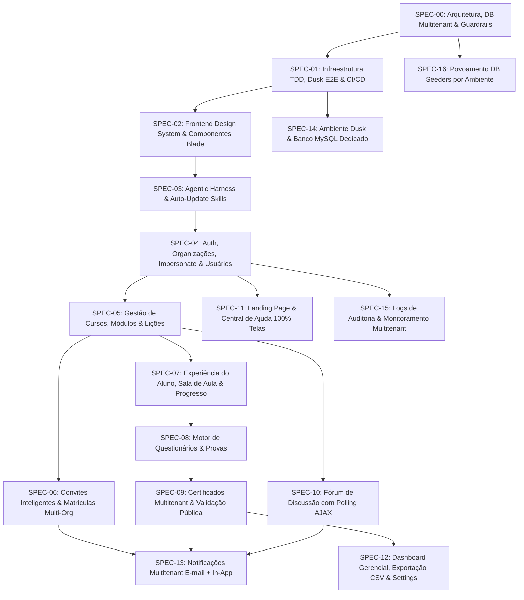

# **Índice Geral de Especificações Técnicas Multitenant, Ordem Sistemática TDD e Roadmap**

---

## **1. Ordem Sistemática TDD (Test-Driven Development)**

A ordem de execução foi configurada com base no princípio cardinal do **TDD (Test-Driven Development)**. A **Infraestrutura de Testes, Drivers Dusk E2E, Quality Gate e Esteira CI/CD (SPEC-01)** são preparados logo na **Fase 1**, permitindo que cada funcionalidade subsequente seja desenvolvida escrevendo testes automatizados em primeiro lugar (TDD):

---

## **2. Repositório de Especificações Técnicas TDD (`spec/specs/`)**

1. **[`00-architecture-database-and-guardrails.md`](file:///home/rafael/projects/cursos/plataforma_ead/spec/specs/00-architecture-database-and-guardrails.md)**: Arquitetura Geral Multitenant, tabela `organizations`, esquema de banco de dados (19 tabelas), Trait `OrgScope`, Roles Spatie (`admin`, `gestor`, `aluno`), 95%+ de Cobertura e **Testes E2E com Laravel Dusk (100% de aprovação)**.
2. **[`01-testing-guardrails-dusk-e2e-and-ci-cd.md`](file:///home/rafael/projects/cursos/plataforma_ead/spec/specs/01-testing-guardrails-dusk-e2e-and-ci-cd.md)**: **TDD Infraestructure & CI/CD Quality Gate**: Configuração inicial do ambiente de testes em memória (SQLite), drivers do **Laravel Dusk E2E**, script auditor CLI (`scripts/check-coverage.php`) e esteira CI/CD **(Prontos no Dia 1 para TDD)**.
3. **[`02-frontend-design-system-blade-components-and-layout.md`](file:///home/rafael/projects/cursos/plataforma_ead/spec/specs/02-frontend-design-system-blade-components-and-layout.md)**: **Frontend Architecture & Blade Components**: Layout Master particionado (`topbar`, `sidebar` dinâmica por Role, `footer`), Design System com variáveis CSS (`:root`), Bootstrap 5.3, catálogo de micro-componentes reutilizáveis Blade e JavaScript/jQuery Clean Code/SOLID.
4. **[`03-agentic-harness-and-self-updating-skills.md`](file:///home/rafael/projects/cursos/plataforma_ead/spec/specs/03-agentic-harness-and-self-updating-skills.md)**: **Agentic Harness & Auto-Update Protocol**: Exigência de no mínimo 3 Skills por feature (`architecture`, `conventions`, `maintenance`) e protocolo automatizado de auto-update.
5. **[`04-auth-profile-organizations-and-user-management.md`](file:///home/rafael/projects/cursos/plataforma_ead/spec/specs/04-auth-profile-organizations-and-user-management.md)**: Autenticação, Perfil, CRUD de Organizações, Impersonate Org pelo Admin, CRUD de Alunos/Gestores e Importação CSV em Lote.
6. **[`05-courses-modules-and-content-management.md`](file:///home/rafael/projects/cursos/plataforma_ead/spec/specs/05-courses-modules-and-content-management.md)**: Gestão Multitenant de Cursos, Módulos com reordenação AJAX e Lições Multimídia (Texto, Imagem, PDF, Vídeo YouTube).
7. **[`06-smart-invitation-and-enrollment-system.md`](file:///home/rafael/projects/cursos/plataforma_ead/spec/specs/06-smart-invitation-and-enrollment-system.md)**: Gerenciamento de Links de Convite por Org, Auto-cadastro e Fluxo Adaptativo Multi-Org para Alunos (RN09).
8. **[`07-student-learning-experience-and-progress.md`](file:///home/rafael/projects/cursos/plataforma_ead/spec/specs/07-student-learning-experience-and-progress.md)**: Área do Aluno "Meus Cursos" (Multi-Org), Sala de Aula, Players, Conclusão de Aulas e Middleware `EnsureStudentIsEnrolled`.
9. **[`08-quizzes-and-evaluations-engine.md`](file:///home/rafael/projects/cursos/plataforma_ead/spec/specs/08-quizzes-and-evaluations-engine.md)**: Motor de Questionários, Player de Provas, Correção Automática, Retries e Gabarito Condicional.
10. **[`09-certificates-and-public-verification.md`](file:///home/rafael/projects/cursos/plataforma_ead/spec/specs/09-certificates-and-public-verification.md)**: Regras de Liberação de Certificados, Geração de PDF com marca da Organização, Hash SHA-256 Imutável e Validação Pública Global (`/validar-certificado`).
11. **[`10-course-discussion-forum.md`](file:///home/rafael/projects/cursos/plataforma_ead/spec/specs/10-course-discussion-forum.md)**: Fórum de Discussão do Curso isolado por `org_id` e matrícula, Sanitização XSS e Polling AJAX jQuery.
12. **[`11-landing-page-and-contextual-help-center.md`](file:///home/rafael/projects/cursos/plataforma_ead/spec/specs/11-landing-page-and-contextual-help-center.md)**: Landing Page Pública, Central de Ajuda Integral com componente `<x-help-button key="..." />` cobrindo 100% das telas (RN05) com suporte a fallback de artigos.
13. **[`12-admin-dashboard-analytics-and-system-settings.md`](file:///home/rafael/projects/cursos/plataforma_ead/spec/specs/12-admin-dashboard-analytics-and-system-settings.md)**: Dashboard Gerencial por Org, Central de Exportação CSV em Streaming $O(1)$ de RAM e Configurações Globais/Por Org.
14. **[`13-notifications-and-alerts.md`](file:///home/rafael/projects/cursos/plataforma_ead/spec/specs/13-notifications-and-alerts.md)**: Notificações Multitenant (E-mail + In-App/sino), gatilhos fechados (convite enviado, certificado emitido, resposta de fórum, matrícula confirmada).
15. **[`14-dusk-testing-environment-and-dedicated-database.md`](file:///home/rafael/projects/cursos/plataforma_ead/spec/specs/14-dusk-testing-environment-and-dedicated-database.md)**: Ambiente de Testes Laravel Dusk e Banco de Dados MySQL Dedicado (`testing`), isolando estritamente a base dev de resets ou migrações.
16. **[`15-system-audit-logging-and-monitoring.md`](file:///home/rafael/projects/cursos/plataforma_ead/spec/specs/15-system-audit-logging-and-monitoring.md)**: Sistema de Logs de Auditoria e Monitoramento Multitenant, rastreamento automatizado de mutações Eloquent, eventos de autenticação (com redação de senhas `[REDACTED]`), ações críticas e expurgo agendado.
17. **[`16-database-seeders-and-environment-seeding.md`](file:///home/rafael/projects/cursos/plataforma_ead/spec/specs/16-database-seeders-and-environment-seeding.md)**: Povoamento Automatizado do Banco de Dados (Database Seeders) por Ambiente com Isolamento Multitenant, Idempotência (`firstOrCreate`/`updateOrCreate`), Padrão Laravel de Seeding Modular e Supressão de Eventos.

---

## **1.1. Escopo Explícito — Fora de Alcance**

* **Pagamentos/Billing/Assinatura:** não existe nenhum módulo financeiro nesta plataforma. `organizations.cnpj` é dado cadastral/institucional apenas (usado na identidade visual do certificado, SPEC-09), sem qualquer fluxo de cobrança associado — ver nota em SPEC-00 §1.1.

---

## **3. Documentação da Arquitetura Multitenant**

O estudo completo e o alinhamento de design do Multitenancy estão salvos em:
👉 **[`spec/docs/multitenancy.md`](file:///home/rafael/projects/cursos/plataforma_ead/spec/docs/multitenancy.md)**
